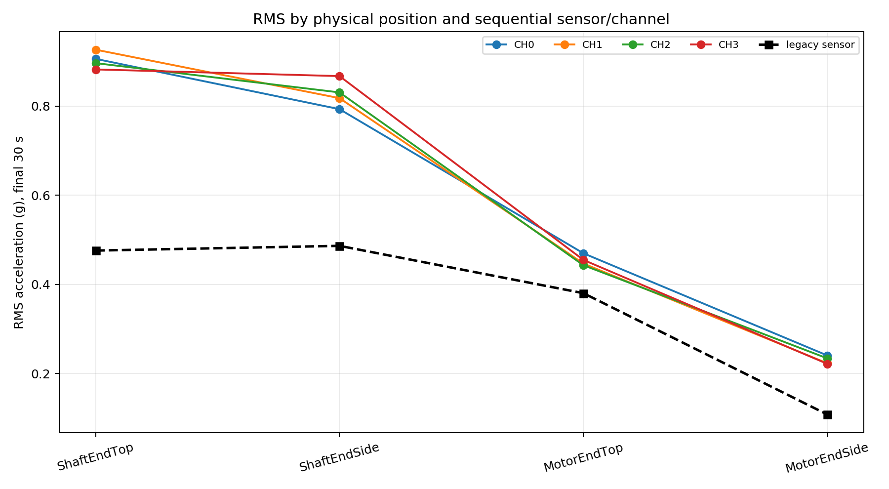
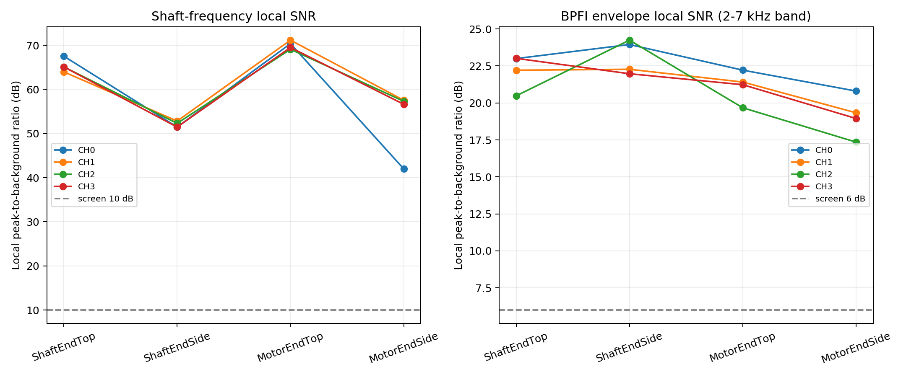
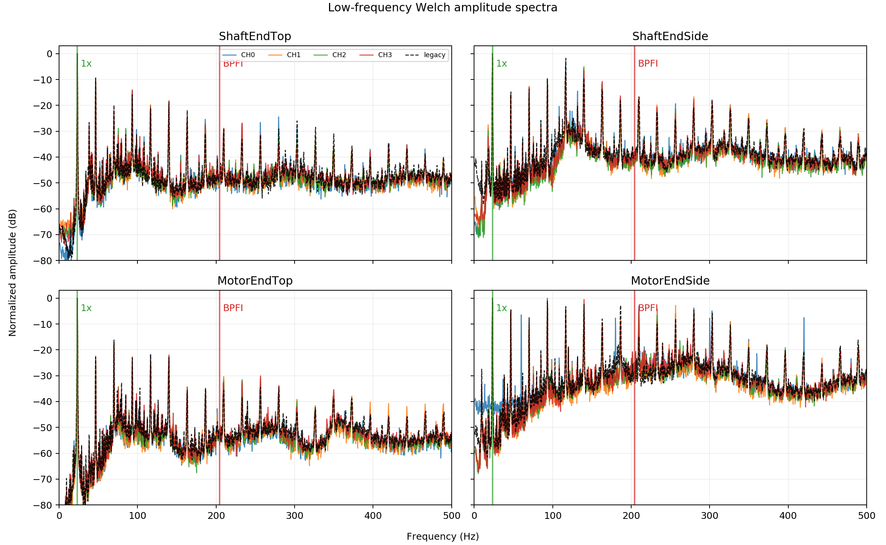
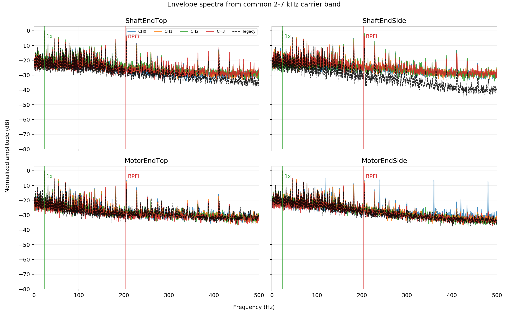
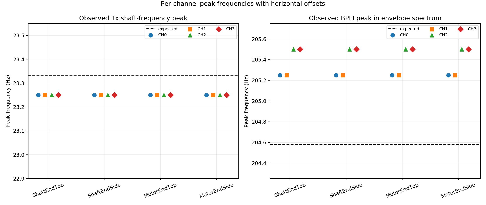
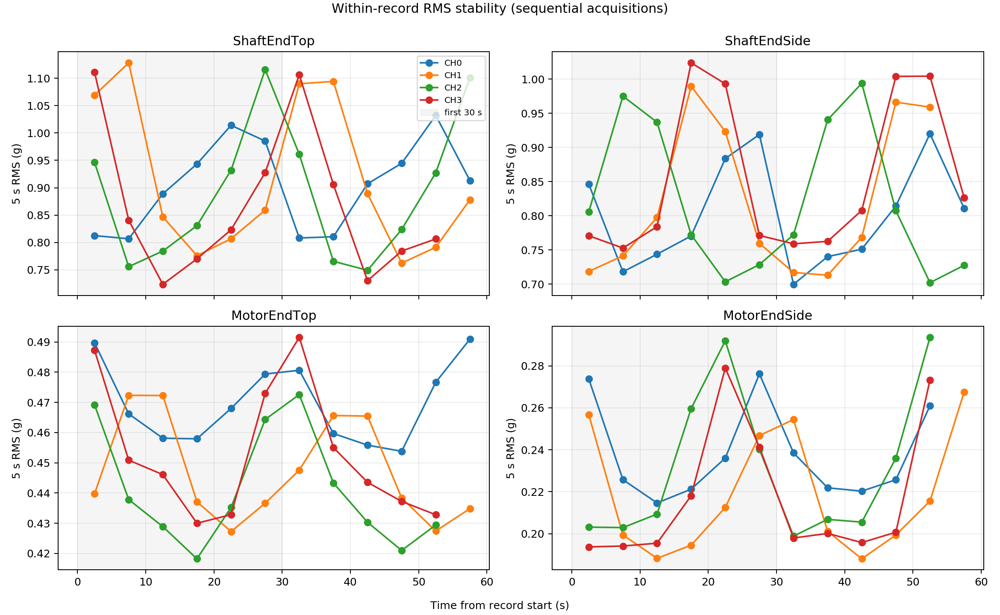
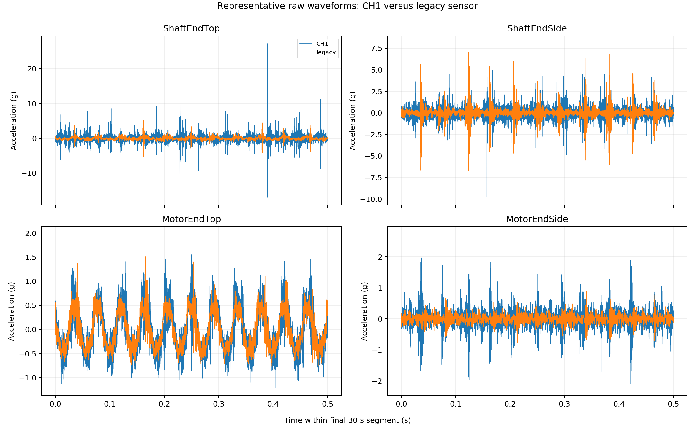
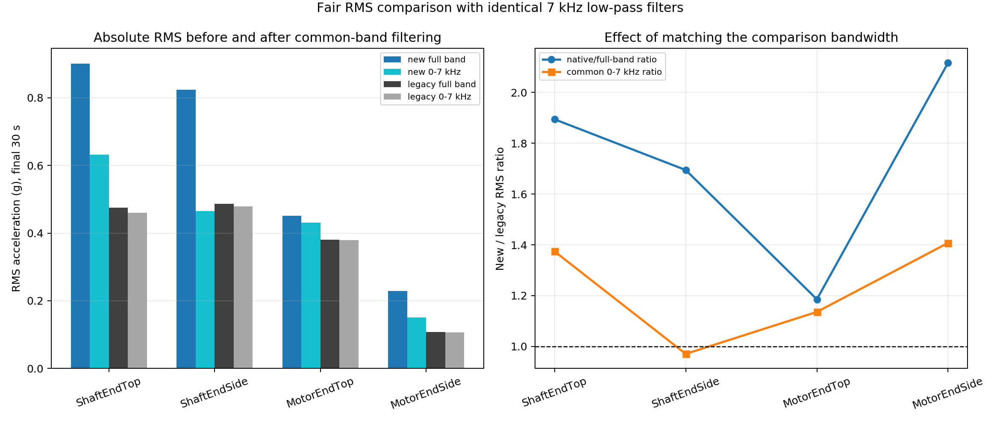
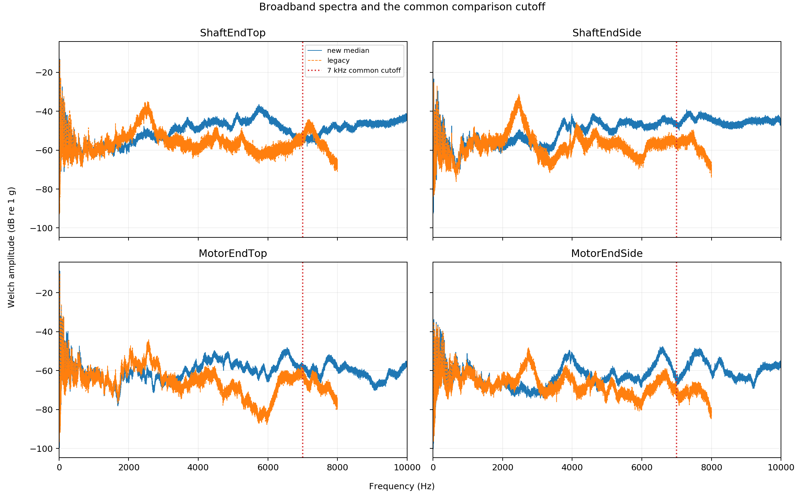
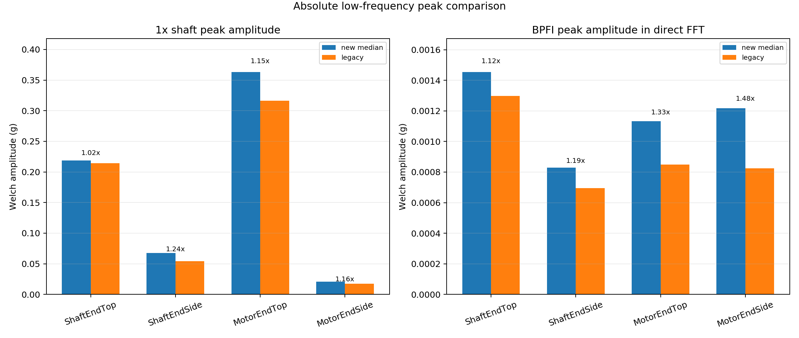

# UOS v2 4개 가속도계·위치 교차시험 검증 보고서

## 결론

**네 HS Sensors 13A131/NI-9234 채널은 이번 1400 RPM·30204·IR 조건에서 모두 정상적으로 진동을 수집한 것으로 판단한다.** 모든 채널이 회전주파수와 IR 결함에 대응하는 BPFI를 검출했고, 동일 위치에서 채널별 RMS와 스펙트럼 형태도 일관적이었다. 특정 채널 하나가 지속적으로 약하거나 강하게 측정되는 현상은 발견되지 않았다. [PILOT-E07–E11]

다만 이것은 **채널·센서 동작 확인에 대한 예비 통과**다. 이번 자료는 순차 단일채널 측정이므로 현재 4개 위치를 최종 확정하거나, 동시 4채널 데이터의 위상·coherence·정보 상보성을 검증한 결과는 아니다. 1400 RPM 하나뿐이어서 저속 대비 고속 RMS 증가도 아직 판단할 수 없다. [PILOT-E02, E15–E16]

## 실험 해석

네 가속도계/DAQ 입력 CH0–CH3를 다음 네 위치에 각각 옮겨가며 측정했다.

1. ShaftEndTop
2. ShaftEndSide
3. MotorEndTop
4. MotorEndSide

따라서 16개 TDMS는 `4채널 × 4위치` 교차시험이다. 같은 순간을 측정한 네 채널이 아니기 때문에 채널 간 직접 파형 정렬, 위상차, coherence는 계산하지 않았다. 대신 위치를 고정했을 때 네 채널의 RMS, 회전주파수, BPFI 포락선 피크, 전체 스펙트럼 형태가 반복되는지를 비교했다.

## 30204 예상 물리 주파수

UOS v1 원 논문 Table 2의 30204 형상값을 사용했다. [PILOT-E06]

| 성분 | 회전수 대비 order | 1400 RPM 예상 주파수 |
|---|---:|---:|
| 회전주파수 `fr` | 1.0000× | 23.333 Hz |
| FTF | 0.4155× | 9.695 Hz |
| BSF | 2.8046× | 65.441 Hz |
| BPFO | 6.2324× | 145.423 Hz |
| BPFI | 8.7676× | 204.577 Hz |

현재 결함은 IR이므로 핵심 확인 대상은 BPFI다. 원신호 FFT에서 BPFI가 항상 큰 피크가 되는 것은 아니므로, 2–7 kHz 공진 대역을 band-pass한 뒤 Hilbert envelope spectrum(힐베르트 포락선 스펙트럼)을 함께 확인했다.

## 채널별 동작 확인

| 채널 | TDMS sensitivity | 위치 보정 RMS 중앙값 | 위치 보정 후 최대 편차 | 회전 피크 통과 | BPFI 포락선 통과 | 판정 |
|---|---:|---:|---:|---:|---:|---|
| CH0 | 0.0964 V/g | 1.0237 | 5.25% | 4/4 | 4/4 | 예비 통과¹ |
| CH1 | 0.1010 V/g | 0.9916 | 2.82% | 4/4 | 4/4 | 통과 |
| CH2 | 0.0991 V/g | 1.0012 | 2.41% | 4/4 | 4/4 | 통과 |
| CH3 | 0.1001 V/g | 0.9940 | 5.22% | 4/4 | 4/4 | 통과 |

¹ CH0 자체 신호에는 이상이 없지만 ShaftEndTop 파일의 bearing metadata가 `H`로 잘못 저장됐다. 실험자가 실제 IR 조건임을 확인했다. 원파일은 변경하지 않고 충돌을 추적한다. [PILOT-E03, E09, E14]

동일 위치에서 네 채널 RMS의 변동계수는 2.06–3.92%였다. 1–500 Hz log-spectrum(로그 스펙트럼)의 채널 쌍 상관 중앙값은 위치별 0.926–0.965, 500–7000 Hz에서는 0.891–0.943이었다. 순차 측정의 자연 변동과 재부착 영향을 포함하고도 전체 형태가 상당히 유사하다. 이는 네 센서/입력 중 명백한 불량 채널이 없다는 판단을 지지한다. 다만 이 상관계수는 동시신호 coherence가 아니다. [PILOT-E09–E10]

## 회전주파수와 BPFI 확인

모든 새 시스템 기록에서 회전주파수 예상값 23.333 Hz 부근의 23.25 Hz peak가 확인됐다. local peak-to-background ratio(국소 피크 대 배경 비)는 41.99–71.17 dB로 충분히 뚜렷했다. [PILOT-E07]

BPFI 예상값은 204.577 Hz다. 2–7 kHz carrier band(반송 공진 대역)의 포락선 스펙트럼에서 모든 기록이 205.25 또는 205.50 Hz 부근의 피크를 보였고, BPFI local ratio는 17.35–24.25 dB였다. 명목 RPM만 있고 tachometer가 없으므로 약 1 Hz 이내 차이는 실제 속도 편차, FFT bin, modulation sideband가 섞인 결과일 수 있다. 이번 자료만으로 정확한 instantaneous RPM(순간 회전수)을 역산해 확정하지 않는다. [PILOT-E08]

직접 FFT의 BPFI 국소 비는 약 0.98–5.28 dB로 비교적 약하지만, 포락선 처리 후 17.35–24.25 dB로 명확해졌다. 이는 충격성 베어링 결함이 구조 공진을 변조하는 전형적인 상황과 부합한다. “FFT에서 BPFI가 가장 큰 피크여야 한다”를 합격 조건으로 사용하면 안 되며, 원신호 FFT와 포락선 스펙트럼을 함께 봐야 한다.

### 채널별 정확한 피크 주파수

기존 FFT와 포락선 그림에서는 네 채널의 peak가 같은 위치에 겹쳐 보인다. 아래 표와 Fig. 10은 마커를 좌우로 벌려 각 채널을 별도로 표시한 결과다. [PILOT-E21]

| 위치 | 채널 | 회전 peak | 회전 예상값과 차이 | BPFI 포락선 peak | BPFI 예상값과 차이 |
|---|---|---:|---:|---:|---:|
| ShaftEndTop | CH0 | 23.25 Hz | −0.083 Hz | 205.25 Hz | +0.673 Hz |
| ShaftEndTop | CH1 | 23.25 Hz | −0.083 Hz | 205.25 Hz | +0.673 Hz |
| ShaftEndTop | CH2 | 23.25 Hz | −0.083 Hz | 205.50 Hz | +0.923 Hz |
| ShaftEndTop | CH3 | 23.25 Hz | −0.083 Hz | 205.50 Hz | +0.923 Hz |
| ShaftEndSide | CH0 | 23.25 Hz | −0.083 Hz | 205.25 Hz | +0.673 Hz |
| ShaftEndSide | CH1 | 23.25 Hz | −0.083 Hz | 205.25 Hz | +0.673 Hz |
| ShaftEndSide | CH2 | 23.25 Hz | −0.083 Hz | 205.50 Hz | +0.923 Hz |
| ShaftEndSide | CH3 | 23.25 Hz | −0.083 Hz | 205.50 Hz | +0.923 Hz |
| MotorEndTop | CH0 | 23.25 Hz | −0.083 Hz | 205.25 Hz | +0.673 Hz |
| MotorEndTop | CH1 | 23.25 Hz | −0.083 Hz | 205.25 Hz | +0.673 Hz |
| MotorEndTop | CH2 | 23.25 Hz | −0.083 Hz | 205.50 Hz | +0.923 Hz |
| MotorEndTop | CH3 | 23.25 Hz | −0.083 Hz | 205.50 Hz | +0.923 Hz |
| MotorEndSide | CH0 | 23.25 Hz | −0.083 Hz | 205.25 Hz | +0.673 Hz |
| MotorEndSide | CH1 | 23.25 Hz | −0.083 Hz | 205.25 Hz | +0.673 Hz |
| MotorEndSide | CH2 | 23.25 Hz | −0.083 Hz | 205.50 Hz | +0.923 Hz |
| MotorEndSide | CH3 | 23.25 Hz | −0.083 Hz | 205.50 Hz | +0.923 Hz |

회전 peak는 16개 모두 같은 23.25 Hz FFT bin에 나타났다. BPFI는 CH0/CH1이 205.25 Hz, CH2/CH3이 205.50 Hz bin에 나타났지만 모두 예상값의 ±1 Hz 이내이고 SNR 선별조건도 통과했다. 0.25 Hz 차이는 현재 Welch frequency resolution 한 bin 차이다. Tachometer가 없고 측정이 순차적이므로 이것을 채널의 주파수 오차로 단정하지 않는다.

## 위치별 결과

| 위치 | 새 센서 RMS 중앙값 | 채널 간 RMS CV | 회전 피크 비 중앙값 | BPFI 포락선 비 중앙값 | 해석 |
|---|---:|---:|---:|---:|---|
| ShaftEndTop | 0.901 g | 2.06% | 65.11 dB | 22.61 dB | 높은 진동과 BPFI 관측 |
| ShaftEndSide | 0.824 g | 3.74% | 51.89 dB | 23.11 dB | BPFI 관측이 가장 강한 위치 |
| MotorEndTop | 0.451 g | 2.62% | 69.94 dB | 21.32 dB | 회전주파수가 가장 뚜렷함 |
| MotorEndSide | 0.228 g | 3.92% | 56.97 dB | 19.14 dB | 진폭은 가장 낮지만 BPFI는 충분히 관측됨 |

IR 결함 베어링이 shaft end에 설치되어 있으므로 shaft-end 위치에서 RMS가 큰 것은 전달경로 관점에서 합리적이다. MotorEndSide도 BPFI가 17 dB 이상으로 검출됐으므로 단순히 “진폭이 작다”는 이유만으로 제외할 수 없다. 반대로 네 위치가 서로 다른 정보를 제공한다는 것도 이번 순차시험만으로 확정할 수 없다. 동일 물리 이벤트의 동시 4채널 신호로 redundancy(중복성), coherence, channel ablation(채널 제거 비교)을 추가 평가해야 한다.

## 원신호 건전성과 기록 안정성

- 16개 TDMS 모두 finite value 100%이며 range exceedance는 없었다.
- 최대 절대 피크는 CH2 ShaftEndTop의 35.58 g로, 13A131의 잠정 ±50 g 범위의 71.15%다.
- 각 기록의 첫 30초와 마지막 30초 RMS 차이는 −2.9%에서 +2.3%였다.
- 기록 길이는 59.6–60.4초로 약 0.8초 범위의 차이가 있다. [PILOT-E04, E11–E12]

이번 자료에서는 첫 30초 RMS가 일관되게 더 높지 않았다. 따라서 “60초 중 첫 30초는 무조건 버린다”는 규칙은 현재 근거로 정당화되지 않는다. 앞으로는 tachometer와 window RMS가 정상범위에 들어온 시점을 stabilization criterion(안정화 기준)으로 정의하고, 실제 안정화 전 구간만 제외하는 편이 낫다.

35.58 g는 범위 안이지만 단일 IR·1400 RPM 조건에서 이미 잠정 범위의 71%다. 고속·로터 결함·복합 결함에서는 피크가 더 커질 수 있으므로, full acquisition 전에 가장 심한 후보조건에서 clipping margin(클리핑 여유)을 다시 시험해야 한다.

## UOS v1 센서 비교

공통 마지막 30초를 사용했을 때 새 시스템의 위치별 RMS 중앙값은 legacy 기록의 1.19–2.12배였고, BPFI 포락선 국소 비는 3.48–8.95 dB 높았다. 회전주파수 국소 비는 두 시스템이 대체로 비슷했다. [PILOT-E13]

이 결과는 새 시스템이 물리 신호를 잘 수집한다는 근거지만, 새 센서가 절대적으로 더 정확하거나 우수하다는 증명은 아니다. 두 시스템은 센서 모델, sampling rate, acquisition time, 부착 반복이 다르고 공통 교정 입력을 사용하지 않았다. RMS가 큰 이유에는 대역폭, mounting, 개별 run 변동이 모두 포함될 수 있다.

## 동일 대역으로 맞춘 RMS 비교

Native/full-band RMS(원래 전체대역 RMS)는 두 시스템의 sampling rate와 주파수 응답 범위가 달라 직접 비교하기 어렵다. Legacy 16 kHz 신호의 Nyquist frequency(나이퀴스트 주파수)가 8 kHz이므로, 양쪽 마지막 30초에 동일한 7 kHz eighth-order Butterworth low-pass(8차 버터워스 저역통과 필터)를 zero-phase(영위상)로 적용했다. 8 kHz는 legacy Nyquist 경계라 필터 transition margin(전이 여유)이 없으므로 공통 cutoff로 사용하지 않았다. [PILOT-E17]

| 위치 | 원래 new/legacy RMS | 동일 0–7 kHz new/legacy RMS | 신규 신호의 0–7 kHz RMS 유지율 | 해석 |
|---|---:|---:|---:|---|
| ShaftEndTop | 1.89× | 1.37× | 70.2% | 대역폭 영향이 크지만 잔여 차이 존재 |
| ShaftEndSide | 1.69× | 0.97× | 56.5% | 차이 대부분이 7 kHz 이상 성분에서 발생 |
| MotorEndTop | 1.19× | 1.14× | 95.6% | 대역폭 영향이 작음 |
| MotorEndSide | 2.12× | 1.41× | 65.8% | 대역폭 영향이 크지만 잔여 차이 존재 |

Legacy는 동일 필터 후 원래 RMS의 96.7–99.7%가 남았지만, 신규는 위치에 따라 56.5–95.6%가 남았다. 따라서 신규 데이터에는 legacy가 충분히 포함하지 못한 7 kHz 이상 에너지가 분명히 많이 존재한다. 다만 그것이 모두 유효한 결함 충격인지, 센서·자석 부착·하우징 공진 또는 노이즈인지는 이번 자료만으로 구분할 수 없다.

동일 대역으로 맞춰도 ShaftEndTop과 MotorEndSide에는 각각 약 37%, 41%의 RMS 차이가 남는다. 따라서 “샘플링레이트 차이가 전부 설명한다”는 결론도 틀리고, “대역폭은 영향이 없다”는 결론도 틀리다. 현재 근거에서는 **대역폭이 크고 위치 의존적인 원인이며, 나머지는 sensor transfer, mounting, run variation, calibration uncertainty가 섞인 것**으로 보는 것이 가장 타당하다.

## 저주파 절대 피크와 calibration 가설 검토

두 시스템에 동일한 4초 Hann-Welch FFT를 적용하여 1×와 직접 FFT BPFI의 절대 amplitude(절대 진폭)를 비교했다. [PILOT-E18]

| 위치 | 1× 신규/legacy | 직접 FFT BPFI 신규/legacy |
|---|---:|---:|
| ShaftEndTop | 1.02× | 1.12× |
| ShaftEndSide | 1.24× | 1.19× |
| MotorEndTop | 1.15× | 1.33× |
| MotorEndSide | 1.16× | 1.48× |

저주파 1×가 모든 위치에서 약 2배라는 패턴은 없다. 특히 ShaftEndTop은 1.02배로 거의 같다. 그러므로 “1×부터 2배이므로 감도 변환 오류가 확정된다”는 해석은 현재 실제 수치와 맞지 않는다. 반대로 1.02–1.24배의 차이가 남으므로 calibration equivalence(교정 동등성)가 완전히 입증된 것도 아니다.

장비 명칭도 구분해야 한다. 현재 신규 장비는 PCB 603C01이 아니라 **HS Sensors 13A131**이다. TDMS에는 CH0–CH3의 dynamic sensitivity가 각각 0.0964, 0.1010, 0.0991, 0.1001 V/g로 기록되고 출력 단위는 이미 `g`다. Legacy PCB 333D01의 `4.00% FSV/g`는 UOS v1 논문에 기재된 digital full-scale 기준 감도이며, `100 mV/g`와 같은 방식의 아날로그 전압 감도가 아니다. UOS v1 MAT도 논문상 `g`로 제공된다. [PILOT-E03, E19]

따라서 현재 우선순위는 다음과 같다.

1. 대역폭 차이는 이번 공통대역 분석으로 정량화했다.
2. gross scale error(큰 배율 오류)는 저주파 1× 결과가 지지하지 않는다.
3. 작은 감도·스케일 오차는 공통 진동 입력 시험 없이는 판정할 수 없다.
4. 최종 calibration 확인은 두 센서를 같은 rigid block(강체 블록)에 나란히 설치하거나 calibration shaker(교정 가진기)로 동시에 측정해야 한다.
5. sensor mass와 mounting 영향은 실제 13A131/333D01 질량·부착 어댑터·표면 상태를 확인한 뒤 동일 부착조건 반복시험으로 분리해야 한다. 603C01 사양을 현재 신규 센서에 적용하면 안 된다.

## 요청된 검증 항목에 대한 판정

| 요청 항목 | 이번 결과 | 판정 |
|---|---|---|
| 네 가속도계/채널이 다른 위치에서도 수집되는가 | 모든 채널이 네 위치에서 finite/range/회전/BPFI 선별조건 통과 | 예비 통과 |
| 회전주파수 peak | 16/16에서 23.25 Hz peak 확인 | 통과 |
| IR 결함주파수 | 16/16에서 포락선 BPFI peak 확인 | 통과 |
| 복합결함 구성요소별 주파수 | 이번 조건은 IR 단일결함 | 미검증 |
| 저속 대비 고속 RMS 증가 | 1400 RPM 한 조건만 존재 | 미검증 |
| 동시 4채널 위치 타당성 | 순차 측정이라 same-event 비교 불가 | 미검증 |
| 새 시스템과 UOS v1 센서 비교 | 회전·BPFI 관측은 동등 이상, 절대 gain 비교는 불가 | 참고 통과 |
| 동일 대역 RMS 비교 | new/legacy 비율이 1.19–2.12에서 0.97–1.41로 감소 | 대역폭이 주요 원인 중 하나 |
| 큰 calibration 배율 오류 | 1× 절대 진폭 비가 1.02–1.24 | 근거 없음; 작은 오차는 미검증 |

## 다음 수집 전 최소 확인사항

대규모 조건 조합을 바로 수집하기보다 다음의 작은 go/no-go grid를 먼저 권장한다.

1. 후보 네 위치에 센서를 고정하고 **동시 4채널**로 healthy와 IR을 측정한다.
2. 같은 bearing·mounting에서 최소 600, 1000, 1400, 1600 RPM을 측정해 RPM별 RMS, 1×, BPFI 이동을 확인한다.
3. 조건당 최소 3회의 독립 run 또는 remove/remount 반복을 수행한다.
4. 가능하면 tachometer를 함께 저장해 실제 RPM과 BPFI tolerance를 order 기준으로 검증한다.
5. 최고 RPM의 심한 rotor+compound 조건에서 ±50 g 및 ±5 V headroom을 점검한다.
6. 센서 serial number, calibration sensitivity, DAQ channel, 물리 위치를 매 run manifest에 고정 기록한다.
7. 60초 파일의 안정화 제외는 고정 30초가 아니라 tach/RMS 기반 규칙으로 결정한다.

이 최소 grid까지 통과하면 본 수집으로 넘어갈 근거가 훨씬 강해진다. 현재 단계의 결론은 **장비·네 채널은 정상 동작하며 IR 물리 성분도 검출된다. 그러나 최종 위치와 전체 수집 프로토콜은 동시 4채널·다중 RPM·반복 파일럿 후 확정한다**이다.

## 본 수집 record 길이 결정

UOS v2의 각 physical condition은 **60초 synchronized four-channel master record**로 수집한다. 25.6 kS/s를 사용할 경우 명목상 채널당 1,536,000 samples, 네 채널 전체 6,144,000 samples다. [PILOT-E20]

60초는 원신호 보존 길이에 대한 결정이다. 모델이 반드시 60초 전체를 입력으로 사용한다는 뜻은 아니다. 1/2/5/10/30/60초 window를 비교하고, 같은 60초 run에서 나온 모든 window는 train/validation/test 중 하나의 split에만 배치한다.

현재 파일럿 TDMS는 명목 60초 설정에도 실제 길이가 59.6–60.4초였다. 본 수집에서는 `duration label`만 믿지 말고 sample count를 검사해야 한다. 25.6 kS/s 기준 목표는 정확히 1,536,000 samples/channel이며, 부족하거나 초과한 record를 재수집할지 정규 길이로 자를지 사전에 규칙을 정해야 한다.
