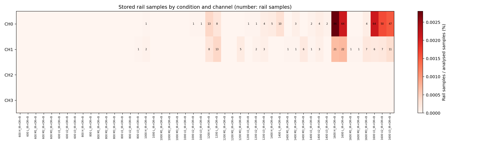
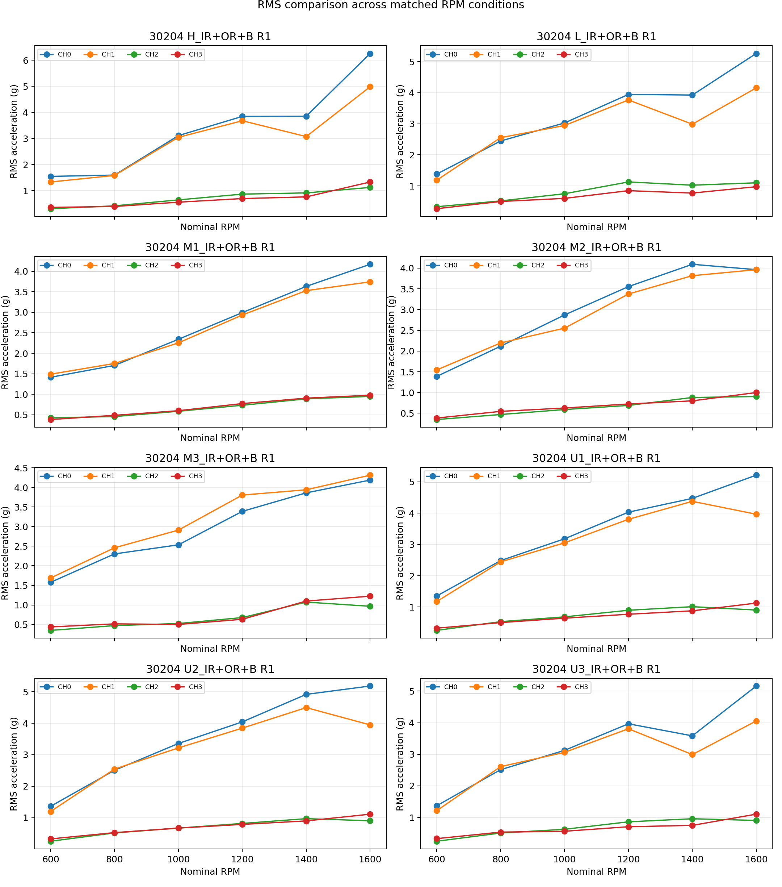
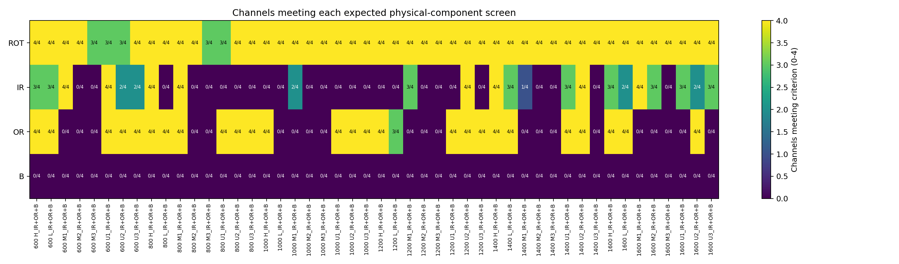

# 30204 IR+OR+B 3중 내부 결함 본 수집 검증

> 실행 당시 상세 보고서임. 현재 판정과 CH0 48개 포락선 FFT 그림은 [`validation/acquisition/30204/IR+OR+B/`](../../30204/IR+OR+B/validation_report_ko.md)의 정리본을 기준으로 함.

> 실행 당시 기록임. 최신 판정과 CH0 48개 포락선 FFT 그림은 [`validation/acquisition/30204/IR+OR+B/`](../../30204/IR+OR+B/validation_report_ko.md)에서 관리함.

## 1. 최종 판단

- 검증 상태: `Needs review`
- 수집 행렬: 48/48조건 확보됨
- 파일 구조·채널 수·sampling rate·분석 길이: 이상 없음
- 회전주파수 1X: 187/192채널에서 자동 기준을 통과하고, 48/48파일에서 최소 3개 채널이 통과함
- RMS: 모든 로터 조건·채널에서 1,600 RPM의 RMS가 600 RPM보다 높게 나타남
- clipping: 493표본이 rail에 도달했으며 26/48파일, 40/192채널에 분포함
- 결함주파수: IR은 70/192채널, OR은 107/192채널에서 보수적 자동 기준을 통과함
- B는 보수적 자동 기준을 통과한 채널이 없어 세 내부 결함의 동시 물리 검증은 완료되지 않음
- 파일·시간축 문제로 전체 48조건을 다시 측정할 근거는 없음
- clipping 허용 기준과 B 검출 기준을 확정하기 전까지 최종 `Pass`로 처리하지 않음

### 요청 검증 항목별 최종 결론

| 요청 검증 항목 | 확인 결과 | 최종 결론 |
|---|---|---|
| 1. 진동값이 가속도계 범위 ±50 g 이내인지 | ±50 g 초과 827/589,824,000표본, 26/48파일·42/192채널에서 확인됨. DAQ rail은 493표본임 | **범위 초과 있음 — 재검토 필요** |
| 2. 저속 대비 고속 RPM의 RMS가 높은지 | 같은 로터 조건·채널 32/32조합에서 1,600 RPM RMS가 600 RPM보다 2.24~4.04배 높음 | **큰 경향 확인됨** |
| 3-1. 원신호 FFT에서 회전주파수 peak가 나타나는지 | 187/192채널 통과, 48/48파일에서 최소 3채널 통과 | **파일 단위로 확인됨** |
| 3-2. 원신호 FFT에서 해당 결함주파수가 나타나는지 | 고조파 하나 이상 기준으로 IR 67/192, OR 107/192, B 9/192채널에서 확인됨 | **IR·OR 부분 확인, B 검출 부족** |
| 3-2. 포락선 FFT까지 포함하면 결함주파수가 나타나는지 | 고조파 하나 이상 기준으로 IR 143/192, OR 134/192, B 32/192채널에서 확인됨 | **검출 채널은 증가하나 B는 제한적임** |
| 3-3. IR+OR+B 구성 성분이 모두 나타나는지 | 보수적 두 고조파 기준에서 IR 70/192, OR 107/192, B 0/192채널이며 세 성분을 모두 통과한 파일은 없음 | **3중 구성 성분 동시 검증 미완료** |
| 수집 묶음 전체 | 구조·시간축과 RPM 경향은 확인됐으나 ±50 g 초과와 B 검출 문제가 남음 | **`Needs review`** |

- 결론적으로 회전 조건과 저속·고속 RMS 경향은 확인됨
- IR·OR 결함주파수는 일부 조건에서 확인됐으나 B 성분은 현재 기준으로 충분히 검증되지 않음
- `±50 g 이내` 조건은 충족되지 않으며 3중 복합 결함의 세 구성 성분이 모두 검증됐다고 결론 내릴 수 없음

## 2. 분석 대상과 구간

| 항목 | 적용 내용 |
|---|---|
| 베어링 | 30204 테이퍼 롤러 베어링 |
| 베어링 결함 | `IR+OR+B` 3중 내부 복합 결함 |
| 로터 조건 | `H`, `L`, `M1`, `M2`, `M3`, `U1`, `U2`, `U3` |
| 회전속도 | 600, 800, 1000, 1200, 1400, 1600 RPM |
| 파일 수 | 48개 = 8개 로터 조건 × 6개 RPM |
| 채널 수 | 파일당 4채널, 총 192채널 |
| sampling rate | TDMS 실측 25,600 Hz |
| 검증 구간 | 모든 파일에서 원파일 60~180초의 120초 |
| 유효 표본 수 | 채널당 3,072,000개, 파일당 12,288,000개 |
| 전체 분석 표본 | 589,824,000개 |

- 최근 본 수집 검증 기준에 따라 48개 파일 모두에서 앞 60초를 제외하고 다음 120초가 적용됨
- 7분을 초과하는 `H_IR+OR+B_25600_30204_1600.tdms`도 주 분석에는 동일하게 60~180초가 적용됨
- 해당 장시간 파일의 기존 300~420초 결과는 주 집계에 포함하지 않고 구간 민감도 참고에만 사용함
- 원자료 근거: 30204 IR+OR+B TDMS 48개 [30204-IOB-R01]
- 베어링 형상과 결함주파수 계산 근거: UOS v1 원 논문 Table 2 [UOSV1-S01, p. 6, Table 2]
- 파일별 실제 구간: [`input_manifest.csv`](results/input_manifest.csv)

## 3. 수집 완전성과 중복 확인

| 검사항목 | 결과 | 판정 |
|---|---:|---|
| 필요한 조건 | 48개 | 기준 |
| 고유 조건 | 48개 | 통과 |
| 누락 조건 | 0개 | 통과 |
| 4채널 존재 | 48/48파일 | 통과 |
| 4채널 표본 수 일치 | 48/48파일 | 통과 |
| 4채널 시작시각 일치 | 48/48파일 | 통과 |
| 실제 sampling rate | 48/48파일에서 25,600 Hz | 통과 |
| 120초 유효 구간 | 48/48파일 | 통과 |

- 600 RPM 파일 8개가 RPM 폴더와 하위 `IR+OR+B/` 폴더에 각각 존재함
- 두 위치의 대응 파일 8쌍은 바이트 단위로 동일함
- 이번 분석에는 RPM 폴더의 한 세트만 사용하여 중복 집계하지 않음
- 원자료 중복 파일은 삭제하거나 변경하지 않음

## 4. 저장 한계값과 clipping

### 4.1 전체 결과

| 항목 | 결과 |
|---|---:|
| 전체 표본 | 589,824,000개 |
| ±50 g 초과 표본 | 827개, 0.000140211% |
| ±50 g 초과 파일·채널 | 26/48파일, 42/192채널 |
| rail 표본 | 493개 |
| 전체 rail 비율 | 0.000083584%, 약 0.836 ppm |
| 입력 한계 접근 표본 | 515개 |
| rail 발생 파일 | 26/48파일 |
| rail 발생 채널 | 40/192채널 |
| 연속 rail 구간 | 482구간 |
| 1표본 rail 구간 | 472구간 |
| 2표본 rail 구간 | 9구간 |
| 3표본 rail 구간 | 1구간 |
| 최장 연속 길이 | 3표본, 117.188 μs |

### 4.2 RPM별 결과

| RPM | ±50 g 초과 표본 | ±50 g 초과 채널 | rail 표본 | rail 발생 채널 |
|---:|---:|---:|---:|---:|
| 600 | 0 | 0/32 | 0 | 0/32 |
| 800 | 1 | 1/32 | 1 | 1/32 |
| 1000 | 10 | 4/32 | 5 | 4/32 |
| 1200 | 83 | 10/32 | 58 | 10/32 |
| 1400 | 67 | 11/32 | 38 | 11/32 |
| 1600 | 666 | 16/32 | 391 | 14/32 |

### 4.3 채널별 결과

| 채널 | ±50 g 초과 표본 | ±50 g 초과 파일 | rail 표본 | rail 발생 파일 |
|---|---:|---:|---:|---:|
| CH0 | 683 | 22/48 | 371 | 20/48 |
| CH1 | 144 | 20/48 | 122 | 20/48 |
| CH2 | 0 | 0/48 | 0 | 0/48 |
| CH3 | 0 | 0/48 | 0 | 0/48 |

- rail은 CH0·CH1에만 나타남
- 1,600 RPM에서는 8개 로터 조건의 모든 파일에 rail이 나타남
- 표본 비율은 매우 낮지만 파일 발생 범위는 넓음
- 따라서 시간 손실은 희소하나 조건별 clipping 표식이 분류 단서로 사용될 가능성은 별도로 검토해야 함
- 반복 발생이므로 단순 파일 재측정만으로 해결된다고 단정할 수 없음
- 저장 한계에서 잘린 실제 peak 진폭은 복원할 수 없음
- 세부 파일·채널별 수치는 [`file_channel_metrics.csv`](results/file_channel_metrics.csv)에 보존됨

## 5. RMS와 RPM 변화

| 항목 | 결과 |
|---|---:|
| 비교 조합 | 8개 로터 조건 × 4채널 = 32개 |
| 600→1,600 RPM 전 구간 계속 증가 | 17/32조합 |
| 1,600 RPM RMS가 600 RPM보다 높음 | 32/32조합 |
| 1,600/600 RPM RMS 비율 | 2.24~4.04배 |

- 고속에서 전체 진동 수준이 저속보다 높다는 큰 경향은 모든 조합에서 확인됨
- 15개 조합에서는 중간 RPM 사이에 국소 감소가 나타남
- 주요 감소는 1,200→1,400 RPM 또는 1,400→1,600 RPM에서 나타남
- RPM 증가에 따른 RMS의 완전한 단조 증가는 합격 조건으로 사용하지 않음
- 구조 공진, 로터 조건, 체결과 수집 간 변동이 RMS에 함께 영향을 줄 수 있음
- 자세한 RPM별 값은 [`rms_rpm_trend.csv`](results/rms_rpm_trend.csv)에 보존됨

## 6. 회전주파수 1X

| 항목 | 결과 |
|---|---:|
| 채널 자동 통과 | 187/192채널 |
| 파일 단위 확인 | 48/48파일에서 최소 3개 채널 통과 |
| 관찰 오차 중앙값 | 0.0625 Hz |
| 최대 관찰 오차 | 0.375 Hz |

- 자동 기준 미통과 5개는 모두 600·800 RPM의 CH0임
- 미통과 조건: `M3·600`, `M3·800`, `U1·600`, `U1·800`, `U2·600 RPM`임
- 이 가운데 네 조건은 관찰 peak가 예상점과 0~0.0625 Hz 차이였지만 주변 대비 크기가 10 dB에 미달함
- `U1·600 RPM·CH0`은 9.625 Hz가 선택되어 예상점과 0.375 Hz 차이가 남음
- 같은 파일의 나머지 세 채널은 1X 기준을 통과함
- 따라서 파일 전체의 회전 성분 누락으로 판단하지 않음
- tachometer가 없으므로 진동 FFT의 1X를 정밀 실측 RPM으로 단정하지 않음

## 7. IR·OR·B 결함주파수

### 7.1 예상 기본 주파수

| 명목 RPM | BPFI | BPFO | BSF |
|---:|---:|---:|---:|
| 600 | 87.13~88.22 Hz | 61.93~62.71 Hz | 27.87~28.22 Hz |
| 800 | 116.72~117.27 Hz | 82.97~83.36 Hz | 37.34~37.51 Hz |
| 1000 | 145.76~146.86 Hz | 103.61~104.39 Hz | 46.63~46.98 Hz |
| 1200 | 174.80~175.90 Hz | 124.26~125.04 Hz | 55.92~56.27 Hz |
| 1400 | 204.39~204.94 Hz | 145.29~145.68 Hz | 65.38~65.56 Hz |
| 1600 | 233.44~233.99 Hz | 165.94~166.33 Hz | 74.67~74.85 Hz |

- 파일별 1X 관찰값을 형상식에 적용하여 같은 명목 RPM 안에서도 작은 범위가 생김

### 7.2 자동 선별 결과

현재 보수적 기준은 같은 포락선 carrier 대역에서 각 결함 기본 주파수의 1·2·3차 고조파 중 2개 이상이 주변 잡음보다 10 dB 이상일 때 통과로 정함.

| 구성 결함 | 두 고조파 이상 통과 | 한 고조파 이상 확인 | 하나 이상의 채널이 통과한 파일 |
|---|---:|---:|---:|
| IR·BPFI | 70/192채널 | 143/192채널 | 23/48파일 |
| OR·BPFO | 107/192채널 | 134/192채널 | 27/48파일 |
| B·BSF | 0/192채널 | 32/192채널 | 0/48파일 |

- IR과 OR이 같은 채널에서 함께 통과한 경우는 47/192채널임
- IR과 OR이 각각 하나 이상의 채널에서 통과한 파일은 15/48파일임
- 세 구성 결함이 모두 통과한 채널과 파일은 없음

### 7.3 원신호 FFT와 포락선 FFT 구분

| 구성 결함 | 원신호 FFT 한 고조파 이상 | 원신호 FFT 두 고조파 이상 | 포락선 FFT 한 고조파 이상 | 포락선 FFT 두 고조파 이상 |
|---|---:|---:|---:|---:|
| IR·BPFI | 67/192 | 24/192 | 143/192 | 70/192 |
| OR·BPFO | 107/192 | 58/192 | 134/192 | 107/192 |
| B·BSF | 9/192 | 1/192 | 32/192 | 0/192 |

- 회전주파수 1X는 원신호 FFT로 판정함
- 결함주파수는 원신호 FFT에서도 확인하되, 베어링 충격의 공진 변조를 보기 위해 포락선 FFT를 함께 사용함
- 포락선 FFT에서 IR·OR 검출은 증가했으나 B는 두 고조파 기준을 만족하지 못함

- IR과 OR은 일부 조건·채널에서 반복적으로 확인됨
- B는 단일 고조파가 기준을 넘은 채널은 있으나, 두 고조파 기준을 만족하지 못함
- 이 결과만으로 B 결함이 원신호에 없다고 결론 내릴 수 없음
- 반대로 현재 결과로 IR+OR+B 세 성분이 모두 검증됐다고 결론 내릴 수도 없음
- 30204 B 단일 결함과 같은 로터·RPM·채널 대조가 필요함
- 정상 대조군에서 같은 peak가 얼마나 나타나는지도 함께 확인해야 함
- 대조 결과에 따라 BSF±FTF 측파대, BSF 2배 성분과 고조파 개수 기준을 재검토할 필요가 있음
- 기준을 낮춰 검출 수만 늘리는 방식은 사용하지 않음
- 개별 예상·관찰 주파수와 주변 대비 값은 [`frequency_detection_detail.csv`](results/frequency_detection_detail.csv)에 보존됨

## 8. 항목별 판정

| 항목 | 판정 | 근거 |
|---|---|---|
| 48조건 완전성 | `Pass` | 누락 없이 48개 고유 조건 확보됨 |
| 4채널·시간축 | `Pass` | 모든 파일에서 채널 수·표본 수·시작시각이 일치함 |
| sampling rate·120초 길이 | `Pass` | 48/48파일에서 25.6 kHz와 채널당 3,072,000표본이 확인됨 |
| clipping | `Needs review` | 493표본, 26/48파일에서 rail이 확인됨 |
| RMS–RPM 경향 | `Pass` 후보 | 모든 조합에서 1,600 RPM RMS가 600 RPM보다 높음 |
| 회전주파수 1X | `Pass` 후보 | 48/48파일에서 최소 3개 채널이 기준을 통과함 |
| IR 구성 성분 | `Needs review` | 70/192채널에서 보수적 기준을 통과함 |
| OR 구성 성분 | `Needs review` | 107/192채널에서 보수적 기준을 통과함 |
| B 구성 성분 | `Needs review` | 두 고조파 기준 통과가 0/192채널임 |
| 수집 묶음 전체 | `Needs review` | clipping 정책과 B 대조 검증이 남음 |

## 9. 권장 조치

1. 30204 B 단일 결함의 동일 로터·RPM 자료와 BSF 검출 결과를 비교함
2. 정상 30204 자료의 동일 주파수 후보를 확인하여 자동 기준의 오검출률을 계산함
3. BSF 기본 성분뿐 아니라 2배 성분과 BSF±FTF 측파대의 반복성을 검토함
4. 1,600 RPM의 rail이 모든 로터 조건에서 반복되므로 개별 파일 단순 재측정보다 clipping 허용·표시·재수집 기준을 먼저 확정함
5. 공개본에는 파일·채널별 rail 표본 수와 위치를 품질 metadata로 제공하는 방안을 검토함
6. 600 RPM 중복 파일은 원자료 정리 시 어느 위치를 정식본으로 사용할지 결정하되, 확인 전에는 삭제하지 않음

## 10. 결과 파일

- 자동 생성 전체 보고서: [`validation_report_ko.md`](validation_report_ko.md)
- 입력 파일과 적용 구간: [`input_manifest.csv`](results/input_manifest.csv)
- 채널별 RMS·peak·rail·1X: [`file_channel_metrics.csv`](results/file_channel_metrics.csv)
- 주파수별 상세 검출값: [`frequency_detection_detail.csv`](results/frequency_detection_detail.csv)
- 원신호·포락선 FFT 구성 성분 요약: [`fft_component_summary.csv`](results/fft_component_summary.csv)
- 물리 성분 검출 요약: [`component_detection_summary.csv`](results/component_detection_summary.csv)
- RMS–RPM 추세: [`rms_rpm_trend.csv`](results/rms_rpm_trend.csv)

## 11. 근거 식별자

- `[30204-IOB-R01]`: `dataset/uosv2/수집 데이터/BearingType_TaperedRoller/` 아래 30204 IR+OR+B 고유 TDMS 48개
- `[UOSV1-S01]`: UOS v1 원 논문, p. 6, Table 2의 30204 베어링 형상
