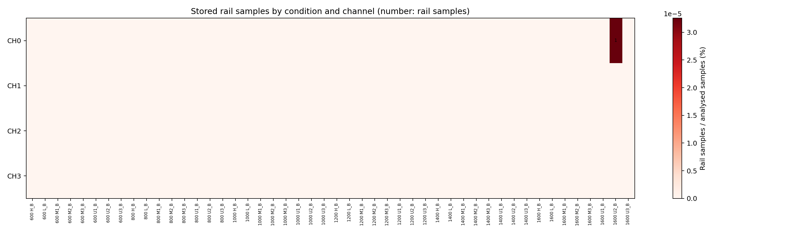
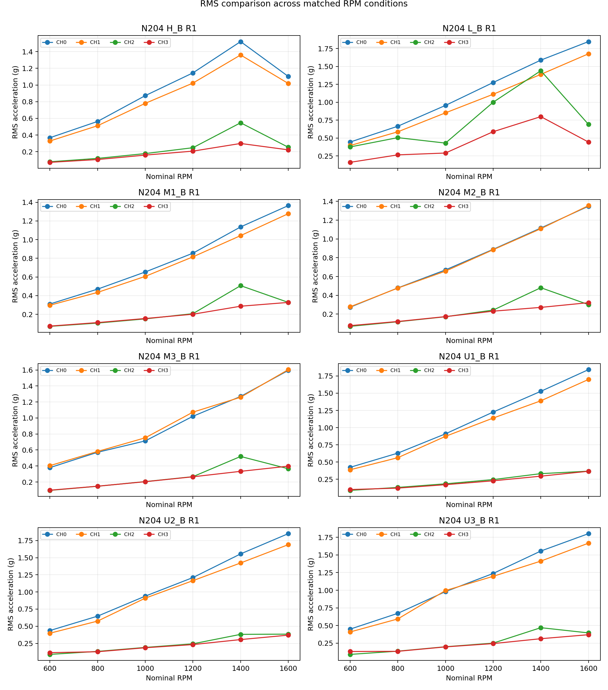
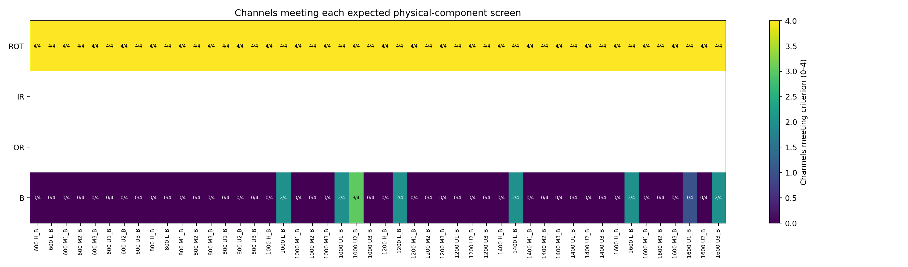

# N204 롤러 단일 결함 본 수집 검증

> 실행 당시 상세 보고서임. 현재 판정과 CH0 48개 포락선 FFT 그림은 [`validation/acquisition/N204/B/`](../../N204/B/validation_report_ko.md)의 정리본을 기준으로 함.

> 실행 당시 기록임. 최신 판정과 CH0 48개 포락선 FFT 그림은 [`validation/acquisition/N204/B/`](../../N204/B/validation_report_ko.md)에서 관리함.

## 1. 최종 판단

- 검증 상태: `Needs review`
- 수집 행렬: 48/48조건 확보됨
- 파일 구조·채널 수·sampling rate·분석 길이: 이상 없음
- 회전주파수 1X: 192/192채널에서 확인됨
- clipping: 전체 589,824,000표본 중 1표본에서만 저장 한계값이 확인됨
- RMS: 모든 로터 조건·채널에서 1,600 RPM의 RMS가 600 RPM보다 높게 나타남
- 롤러 결함주파수 BSF: 현재 자동 기준에서 16/192채널만 통과하여 물리 검증이 완료되지 않음
- 전체 48조건을 다시 측정할 근거는 확인되지 않음
- `U2_B·1,600 RPM·CH0`의 단일 rail 표본과 `H_B·1,400/1,600 RPM`의 RMS 역전은 선별 재검토가 필요함

### 요청 검증 항목별 최종 결론

| 요청 검증 항목 | 확인 결과 | 최종 결론 |
|---|---|---|
| 1. 진동값이 가속도계 범위 ±50 g 이내인지 | ±50 g 초과 3/589,824,000표본, 2/48파일·3/192채널에서 확인됨. 이 중 DAQ rail과 일치한 표본은 1개임 | **범위 초과 있음 — 재검토 필요** |
| 2. 저속 대비 고속 RPM의 RMS가 높은지 | 같은 로터 조건·채널 32/32조합에서 1,600 RPM RMS가 600 RPM보다 1.84~4.94배 높음 | **큰 경향 확인됨** |
| 3-1. 원신호 FFT에서 회전주파수 peak가 나타나는지 | 192/192채널에서 RPM/60 부근 1X가 확인됨 | **확인됨** |
| 3-2. 원신호 FFT에서 롤러 결함주파수 BSF가 나타나는지 | BSF 고조파 하나 이상 39/192채널, 두 개 이상 5/192채널에서 확인됨 | **일부 채널에서 확인됨** |
| 3-2. 포락선 FFT까지 포함하면 BSF가 나타나는지 | BSF 고조파 하나 이상 64/192채널, 같은 대역에서 두 개 이상 16/192채널에서 확인됨 | **부분 확인됨** |
| 3-3. 복합 결함의 구성 주파수가 나타나는지 | 본 묶음은 B 단일 결함이므로 해당하지 않음 | **해당 없음** |
| 수집 묶음 전체 | 구조·시간축과 1X는 정상이나 ±50 g 초과 3표본과 낮은 BSF 검출률이 남음 | **`Needs review`** |

- 결론적으로 회전 조건과 저속·고속 RMS 경향은 확인됨
- 롤러 결함 성분은 일부 채널에서 확인됐으나 모든 조건에서 일관되게 검출됐다고 보기는 어려움
- `±50 g 이내` 조건은 엄밀하게 충족되지 않음

## 2. 분석 대상과 기준

| 항목 | 적용 내용 |
|---|---|
| 베어링 | N204 원통 롤러 베어링 |
| 베어링 결함 | 롤러 단일 결함 `B` |
| 로터 조건 | `H`, `L`, `M1`, `M2`, `M3`, `U1`, `U2`, `U3` |
| 회전속도 | 600, 800, 1000, 1200, 1400, 1600 RPM |
| 파일 수 | 48개 = 8개 로터 조건 × 6개 RPM |
| 채널 수 | 파일당 4채널, 총 192채널 |
| sampling rate | TDMS 실측 25,600 Hz |
| 제외 구간 | 원파일 앞 60초 |
| 검증 구간 | 원파일 60~180초의 120초 |
| 유효 표본 수 | 채널당 3,072,000개, 파일당 12,288,000개 |

- 원자료 근거: N204 B 본 수집 TDMS 48개 [N204-B-R01]
- 베어링 형상과 결함주파수 계산 근거: UOS v1 원 논문 Table 2 [UOSV1-S01, p. 6, Table 2]
- 세부 입력 파일과 실제 적용 구간: [`input_manifest.csv`](results/input_manifest.csv)

## 3. 수집 완전성과 시간축

| 검사항목 | 결과 | 판정 |
|---|---:|---|
| 필요한 조건 | 48개 | 기준 |
| 확인된 조건 | 48개 | 통과 |
| 누락 조건 | 0개 | 통과 |
| 중복 조건 | 0개 | 통과 |
| 4채널 존재 | 48/48파일 | 통과 |
| 4채널 표본 수 일치 | 48/48파일 | 통과 |
| 4채널 시작시각 일치 | 48/48파일 | 통과 |
| 실제 sampling rate | 48/48파일에서 25,600 Hz | 통과 |
| 120초 유효 구간 확보 | 48/48파일 | 통과 |

- 모든 파일에서 원파일 앞 60초가 제외됨
- 제외 후 이어지는 120초만 분석됨
- 원파일이 180초보다 길어도 180초 이후 구간은 이번 비교에서 사용하지 않음

## 4. 저장 한계값과 clipping

### 4.1 전체 결과

| 항목 | 결과 |
|---|---:|
| 분석 표본 | 589,824,000개 |
| ±50 g 초과 표본 | 3개, 0.000000509% |
| ±50 g 초과 파일·채널 | 2/48파일, 3/192채널 |
| rail 표본 | 1개 |
| 전체 rail 비율 | 0.000000170% |
| rail 발생 파일 | 1/48파일 |
| rail 발생 채널 | 1/192채널 |
| 2표본 이상 연속 rail | 0구간 |

### 4.2 발생 위치

| 파일 | 채널 | ±50 g 초과 표본 | 최솟값 | 최댓값 | DAQ rail 표본 |
|---|---|---:|---:|---:|---:|
| `L_B_25600_N204_1600.tdms` | CH0 | 1 | -40.8624 g | 52.0058 g | 0 |
| `U2_B_25600_N204_1600.tdms` | CH0 | 1 | -53.1292 g | 47.5798 g | 1 |
| `U2_B_25600_N204_1600.tdms` | CH1 | 1 | -37.8035 g | 50.0306 g | 0 |

- DAQ rail 표본은 `U2_B·1,600 RPM·CH0`의 원파일 94.035273초, 분석 구간 내 34.035273초에 나타남
- 해당 표본 전후 가속도: `18.2792 → -53.1292 → -41.7242 g` 순으로 나타남
- rail 표본이 실제로 분석한 60~180초 안에 포함됨
- 한 표본만 저장 한계값과 일치하며 평평하게 이어지는 긴 포화 구간은 확인되지 않음
- 원래 충격 진폭은 저장 한계에서 잘렸으므로 정확한 실제 peak는 복원할 수 없음
- 비율이 매우 낮더라도 최종 공개 자료에서 rail을 허용할지는 별도의 품질 기준으로 결정해야 함
- rail을 한 표본도 허용하지 않는 정책을 적용할 경우 `U2_B·1,600 RPM`만 우선 재측정하는 방안이 타당함

## 5. RMS와 RPM 변화

### 5.1 전체 경향

- 32개 로터 조건·채널 조합 중 22개에서 600→1,600 RPM 전 구간의 RMS가 계속 증가함
- 나머지 10개도 모두 1,600 RPM RMS가 600 RPM RMS보다 높게 나타남
- 1,600/600 RPM RMS 비율은 1.84~4.94배로 나타남
- 따라서 고속 조건의 전체 진동 수준이 저속 조건보다 높다는 큰 경향은 확인됨
- 다만 RPM 증가마다 RMS가 반드시 증가한다는 뜻은 아님

### 5.2 1,400→1,600 RPM에서 감소한 조합

| 로터 조건 | 감소 채널 | 1,600/1,400 RPM RMS 비율 |
|---|---|---|
| `H` | CH0, CH1, CH2, CH3 | 0.725, 0.749, 0.464, 0.745 |
| `L` | CH2, CH3 | 0.480, 0.556 |
| `M1` | CH2 | 0.647 |
| `M2` | CH2 | 0.625 |
| `M3` | CH2 | 0.704 |
| `U3` | CH2 | 0.842 |

- `H`에서는 네 채널 모두 1,400 RPM보다 1,600 RPM에서 낮게 나타남
- CH2에서는 여러 로터 조건에서 같은 감소가 반복됨
- 가능한 원인에는 구조 공진대역 통과, 센서 위치의 전달 특성, 체결·운전 반복 차이가 포함됨
- 현재 자료만으로 원인을 하나로 확정할 수 없음
- 1X는 해당 파일들에서도 확인되므로 회전 자체가 기록되지 않은 문제로 해석되지는 않음
- `H_B·1,400/1,600 RPM` 반복 측정 또는 120초 내부 구간별 RMS 비교가 우선 확인 항목임

## 6. 회전주파수 1X

| 항목 | 결과 |
|---|---:|
| 자동 검출 | 192/192채널 |
| 예상 주파수 | RPM/60 |
| 관찰 오차 중앙값 | 0.0208 Hz |
| 최대 관찰 오차 | 0.0833 Hz, 약 5 RPM |

- 600~1,600 RPM의 모든 파일과 채널에서 명목 회전주파수 부근 peak가 확인됨
- 수집 장치가 각 운전 조건의 회전 성분을 기록했다는 근거가 됨
- tachometer가 없으므로 진동 FFT의 1X를 정밀 실측 RPM으로 단정하지 않음

## 7. 롤러 결함주파수 BSF

### 7.1 예상 주파수

| 명목 RPM | 분석 자료에서 사용한 BSF 범위 |
|---:|---:|
| 600 | 약 21.56 Hz |
| 800 | 약 28.71~28.84 Hz |
| 1000 | 약 35.85~36.12 Hz |
| 1200 | 약 42.99~43.26 Hz |
| 1400 | 약 50.27~50.41 Hz |
| 1600 | 약 57.41~57.55 Hz |

- 파일별 1X 관찰값을 베어링 형상식에 적용했기 때문에 같은 명목 RPM 안에서도 작은 차이가 발생함

### 7.2 자동 선별 결과

현재 자동 기준은 같은 포락선 carrier 대역에서 BSF의 1·2·3차 고조파 중 2개 이상이 주변 잡음보다 10 dB 이상일 때 통과로 정함.

| 구분 | 통과 |
|---|---:|
| 전체 | 16/192채널 |
| 600 RPM | 0/32채널 |
| 800 RPM | 0/32채널 |
| 1000 RPM | 7/32채널 |
| 1200 RPM | 2/32채널 |
| 1400 RPM | 2/32채널 |
| 1600 RPM | 5/32채널 |
| CH0 | 8/48파일 |
| CH1 | 5/48파일 |
| CH2 | 2/48파일 |
| CH3 | 1/48파일 |

### 7.3 원신호 FFT와 포락선 FFT 구분

| 분석 방법 | BSF 고조파 하나 이상 | BSF 고조파 두 개 이상 | 해석 |
|---|---:|---:|---|
| 원신호 FFT | 39/192채널 | 5/192채널 | 일부 채널에서 직접 성분이 확인됨 |
| 포락선 FFT | 64/192채널 | 16/192채널 | 원신호보다 검출 채널이 늘지만 전체 조건에서 일관되지는 않음 |

- 회전주파수 1X는 원신호 FFT로 판정함
- 롤러 결함은 원신호 FFT 결과를 보존하면서 충격의 공진 변조를 보기 위한 포락선 FFT를 함께 사용함

- BSF 1개 고조파만 기준을 넘은 경우까지 포함하면 검출 수가 증가하지만, 오검출도 함께 증가할 수 있음
- B 결함 자료인데 OR 후보가 7/192채널에서 통과하고 IR 후보는 0/192채널에서 통과함
- 위 결과는 현재 고정 기준의 특이도가 충분히 검증되지 않았음을 보여줌
- 16/192라는 값만으로 롤러 결함이 기록되지 않았다고 결론 내릴 수 없음
- 반대로 레이블만으로 BSF가 충분히 검증됐다고 결론 내릴 수도 없음
- 동일 베어링·로터·RPM의 정상 대조 자료와 비교하여 BSF 주변 증가량과 오검출률을 먼저 정해야 함
- 개별 예상·관찰 주파수와 주변 잡음 대비 값은 [`frequency_detection_detail.csv`](results/frequency_detection_detail.csv)에 보존됨

## 8. 항목별 판정

| 항목 | 판정 | 근거 |
|---|---|---|
| 48조건 완전성 | `Pass` | 누락·중복 없이 48/48조건 확보됨 |
| 4채널·시간축 | `Pass` | 모든 파일에서 채널 수·표본 수·시작시각이 일치함 |
| sampling rate·120초 길이 | `Pass` | 48/48파일에서 25.6 kHz와 채널당 3,072,000표본 확인됨 |
| clipping | `Needs review` | U2_B·1,600 RPM·CH0에서 rail 1표본 확인됨 |
| RMS–RPM 경향 | `Needs review` | 전체 저속·고속 경향은 확인됐으나 일부 1,400→1,600 RPM 역전이 존재함 |
| 회전주파수 1X | `Pass` | 192/192채널에서 확인됨 |
| 롤러 결함주파수 BSF | `Needs review` | 현재 보수적 기준의 검출률과 특이도가 충분하지 않음 |
| 수집 묶음 전체 | `Needs review` | 구조적 수집은 완료됐으나 clipping 1표본과 BSF 기준 보정이 남음 |

## 9. 권장 조치

1. 전체 48조건을 일괄 재측정하지 않음
2. rail을 허용하지 않는 공개 정책이라면 `U2_B·1,600 RPM`을 우선 재측정함
3. `H_B·1,400/1,600 RPM`을 반복 측정하여 네 채널 RMS 감소가 재현되는지 확인함
4. 정상 N204 자료가 확보되면 같은 로터·RPM·채널끼리 B 자료와 비교함
5. 정상 대조군의 오검출률을 확인한 뒤 BSF 고조파 개수·주변 잡음 대비 기준을 확정함
6. 자동 검출 결과와 연구자의 최종 판정을 분리하여 유지함

## 10. 결과 파일

- 자동 생성 전체 보고서: [`validation_report_ko.md`](validation_report_ko.md)
- 입력 파일과 적용 구간: [`input_manifest.csv`](results/input_manifest.csv)
- 채널별 RMS·peak·rail·1X: [`file_channel_metrics.csv`](results/file_channel_metrics.csv)
- 주파수별 상세 검출값: [`frequency_detection_detail.csv`](results/frequency_detection_detail.csv)
- 원신호·포락선 FFT 구성 성분 요약: [`fft_component_summary.csv`](results/fft_component_summary.csv)
- 물리 성분 검출 요약: [`component_detection_summary.csv`](results/component_detection_summary.csv)
- RMS–RPM 추세: [`rms_rpm_trend.csv`](results/rms_rpm_trend.csv)

## 11. 근거 식별자

- `[N204-B-R01]`: `dataset/uosv2/수집 데이터/BearingType_CylindricalRoller/` 아래 N204 B TDMS 48개, 분석 구간 60~180초
- `[UOSV1-S01]`: UOS v1 원 논문, p. 6, Table 2의 N204 베어링 형상
