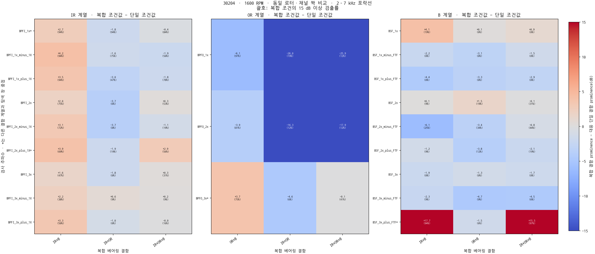
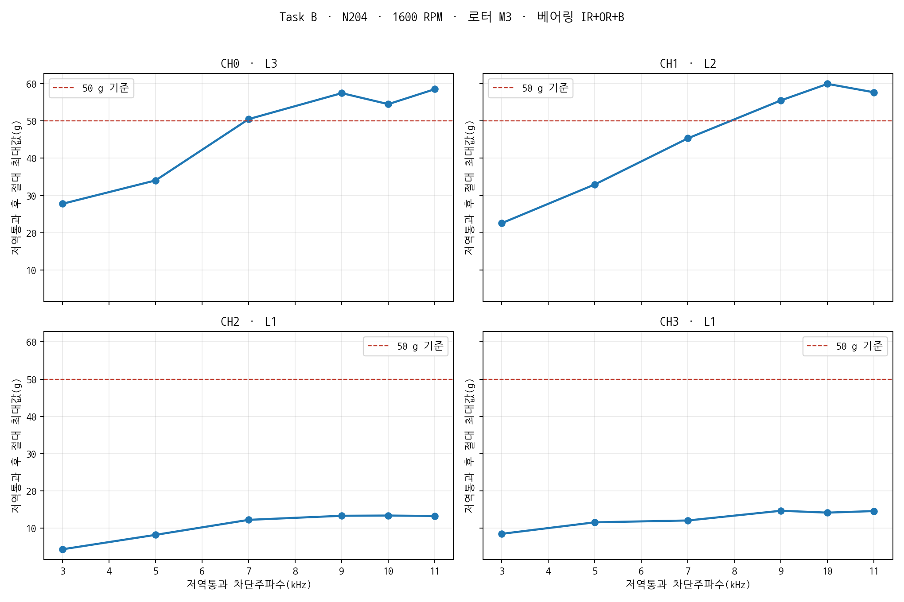
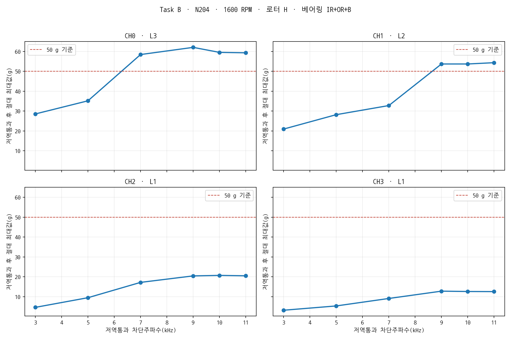
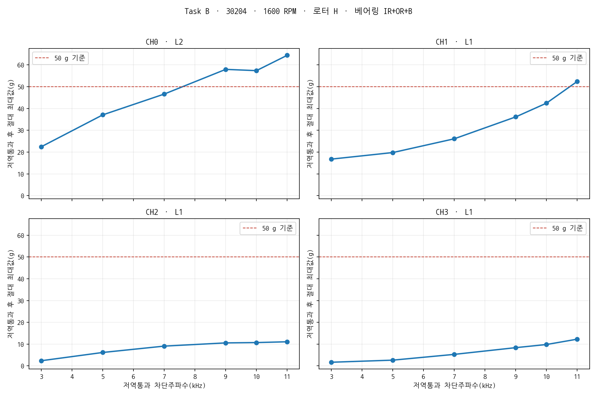
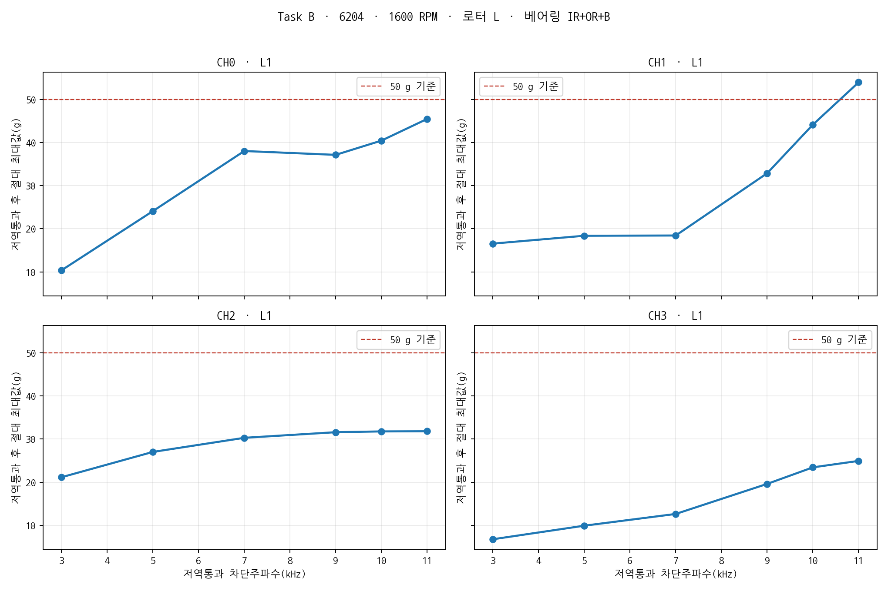
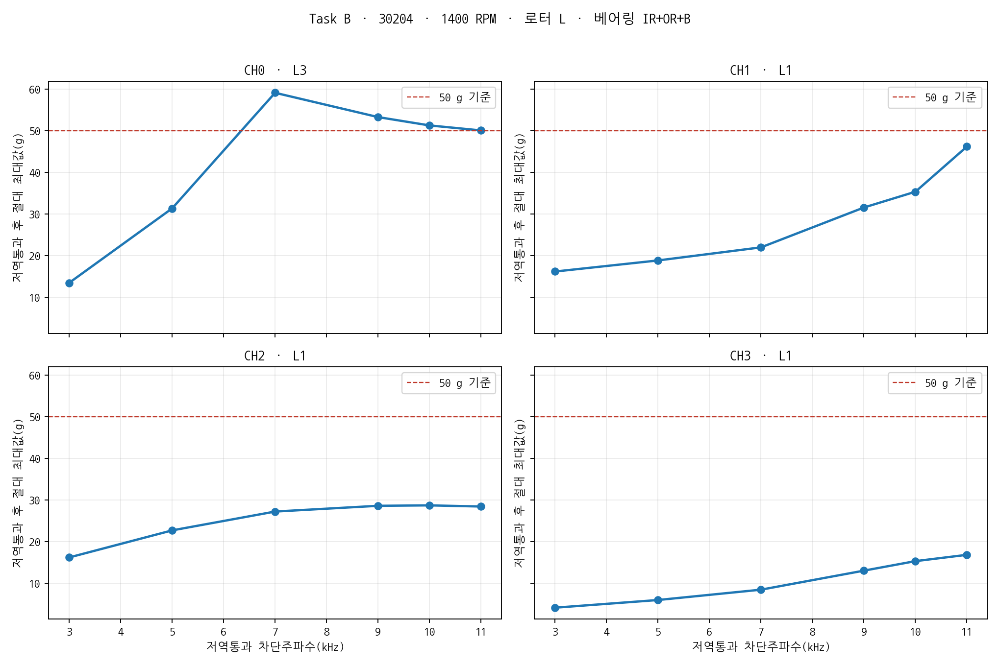
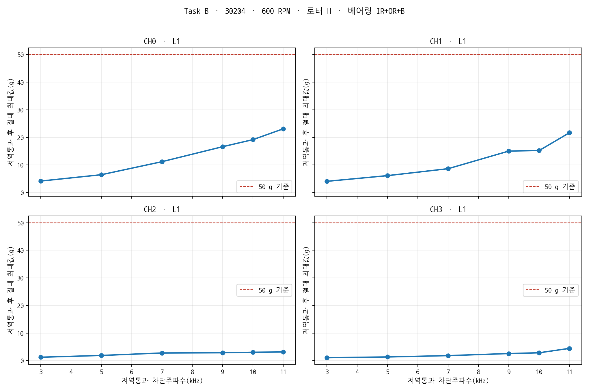
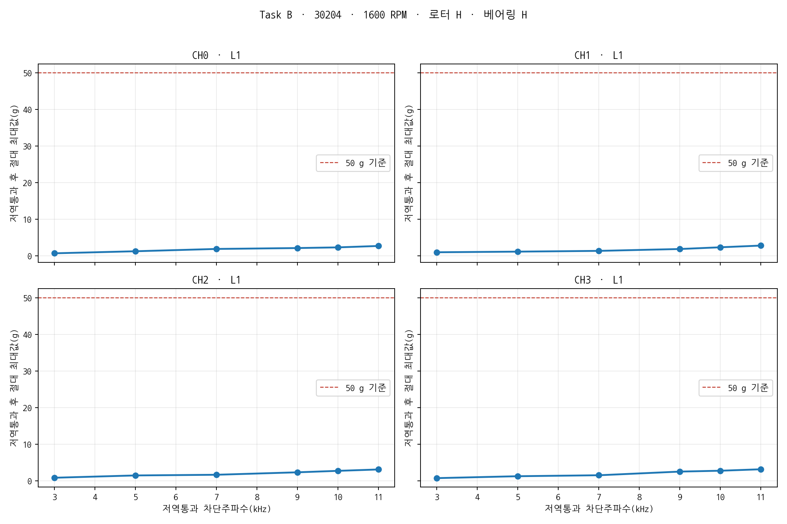
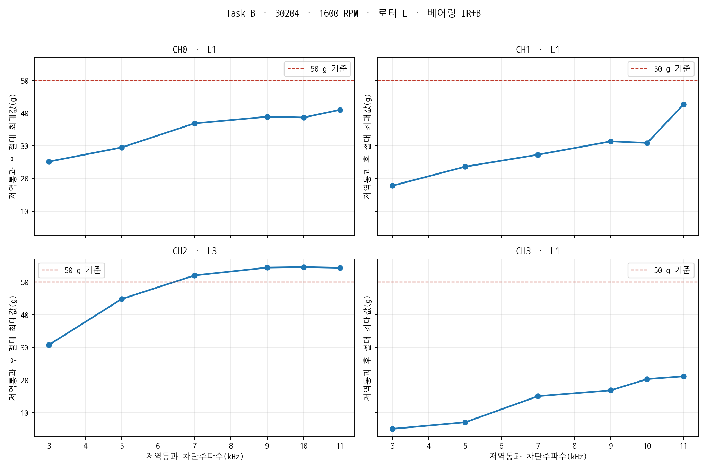

# UOS v2 복합 결함 주파수와 Task B 분석

- 작성일: 2026-08-03
- 대상 원자료: 중복 제외 TDMS 116개·4채널
- 유효 측정구간: 일반 파일 60~180초, 30204·7분 초과 파일 300~420초
- 참고 논문: S1-S01, Wang et al., PLOS ONE, 2024
- 참고 작업지시서: `library/documents/design/clipping/UOS_v2_클리핑_조사_작업지시서.pdf`
- 분석 목적: 복합 결함의 고조파·측파대 확인과 ADC 포화 원인 대역 판단

## 1. 최종 판단

- 기존 BPFO·BPFI·BSF 기본주파수 분석만으로 복합 결함 검증이 부족했음
- S1-S01의 물리 모델에 따라 고조파와 변조 측파대까지 분석 범위 확장함
- 30204·1600 RPM에서 단일 결함과 복합 결함을 동일 로터·동일 채널끼리 짝지어 비교함
- IR+B에서 IR 계열이 단일 IR보다 대체로 강해지는 경향 확인됨
- IR+OR와 IR+OR+B에서 OR 계열이 단일 OR보다 크게 약해지는 경향 확인됨
- 단일 B에서 기본 BSF보다 `2×BSF-FTF`가 더 잘 검출됨
- IR+B와 IR+OR+B의 `3×BSF+FTF`는 BPFI와 탐색 범위가 겹쳐 B 성분의 독립 근거로 사용 불가능함
- 복합 결함이 단일 결함 성분의 단순 합으로 나타나지 않음
- 구성 결함이 추가되면서 일부 성분은 증가하고 다른 성분은 약화·소실됨
- Task B의 L1·L2·L3 결과가 채널별로 혼재함
- 50 g 이상 10채널 중 7채널에서 저역통과 곡선이 비단조 또는 오버슈트 형태임
- 이미 포화된 신호의 저역통과 최대값만으로 센서 구매 여부 결정 불가능함
- ADC 포화가 발생한 10채널 중 8채널에서 Task B 지목 대역에 확장 결함 계열 15 dB 이상 성분 존재함
- 고주파 성분의 결함 동기성 근거는 있으나 절대진폭 정확성과 마운팅 영향은 미확정 상태임

## 2. S1 논문에서 실제로 확인한 주파수 계열

### 2.1 원문 근거

| Source ID | 원문 위치 | 확인 내용 |
|---|---|---|
| S1-S01 | p. 4, 식 (1)~(2) | OR 충격의 `k×BPFO`, IR 충격의 `m×BPFI+n×회전주파수` 모델 제시함 |
| S1-S01 | p. 6~8, 식 (4), (6), (9) | 전동체 충격의 `m×BSF+n×FTF` 모델 제시함 |
| S1-S01 | p. 10, Table 2 | 6205의 회전·IR·OR·전동체·케이지 주파수 제시함 |
| S1-S01 | p. 12, Fig. 11 | IR+OR에서 BPFO·BPFI·고조파·BPFI±회전주파수 확인함 |
| S1-S01 | p. 13, Fig. 12 | IR+B에서 BPFI·BSF·고조파·각 측파대 확인함 |
| S1-S01 | p. 14, Fig. 13 | OR+B에서 BPFO·BSF·고조파·BSF±FTF 확인함 |
| S1-S01 | p. 14, Fig. 14 | IR+OR+B에서 세 결함 계열의 동시 존재와 간섭에 따른 소실 확인함 |

### 2.2 이번 코드에서 검사한 항목

| 결함 성분 | 기본주파수 | 고조파 | 물리적으로 예상되는 측파대 |
|---|---|---|---|
| 외륜 OR | BPFO | 2×BPFO, 3×BPFO | 별도 측파대 강제 검색하지 않음 |
| 내륜 IR | BPFI | 2×BPFI, 3×BPFI | `n×BPFI-1×`, `n×BPFI+1×` |
| B 또는 roller | BSF | 2×BSF, 3×BSF | `n×BSF-FTF`, `n×BSF+FTF` |

### 2.3 검색에서 제외한 항목

- `BPFI±BPFO`의 무차별 검색 제외함
- `BPFI±BSF`의 무차별 검색 제외함
- `BPFO±BSF`의 무차별 검색 제외함
- S1-S01의 운동학적 모델에 없는 조합을 복합 결함 증거로 사용하지 않음
- 후보를 많이 만들수록 우연한 피크를 선택할 가능성이 커지는 문제 방지함

## 3. 분석 방법

- 각 파일의 유효 측정구간 중 앞 10초 사용함
- 일반 파일은 60~70초, 30204·7분 초과 파일은 300~310초 사용함
- 파일별 진동 신호에서 추정한 1× 회전수 후보 사용함
- 베어링 geometry: UOS v1 원논문 p. 6 Table 2 값 사용함
- 포락선 carrier 대역: 2~7 kHz, 7~10 kHz, 10~11.2 kHz 사용함
- 주파수 분해능: 10초 구간 기준 약 0.1 Hz임
- 검출 기준: 예상 주파수 주변 피크가 국소 배경 중앙값보다 15 dB 이상 높음
- 비교 기준: prominence 사용함
- prominence 의미: 예상 주파수 피크가 주변 바닥보다 얼마나 두드러지는지 나타냄
- 절대 진폭의 크기와 동일한 지표가 아님
- 전체 결과 행: 32,016개임
- 계산 구성: 116파일 × 4채널 × 3 carrier 대역 × 23개 주파수 후보임

## 4. 주파수 중첩 확인

### 4.1 중첩을 확인해야 하는 이유

- 서로 다른 식으로 계산된 두 후보가 같은 탐색 창에 들어올 수 있음
- 한 피크를 IR과 B의 증거로 동시에 잘못 계산할 수 있음
- 복합 조건에서 특정 성분이 강해졌다는 잘못된 결론 가능함

### 4.2 30204·1600 RPM의 중요 중첩

| 후보 1 | 후보 2 | 주파수 차이 | 판단 |
|---|---|---:|---|
| BPFI | `3×BSF+FTF` | 약 1.65 Hz | 현재 탐색 창 중첩됨 |
| `2×BPFI+1×` | 3×BPFO | 약 4.32 Hz | 현재 탐색 창 중첩됨 |

### 4.3 적용 원칙

- 다른 결함 계열과 탐색 창이 겹치는 후보에 `*` 표시함
- `3×BSF+FTF`가 강해도 BPFI가 존재하는 IR+B·IR+OR+B에서는 B의 독립 증거로 인정하지 않음
- Task B와 결함주파수 결합 판정에서는 중첩 후보 제외함
- 상세 CSV에 최근접 다른 계열 후보와 주파수 차이 기록함

## 5. 30204·1600 RPM 단일-복합 짝 비교

### 5.1 비교 단위

- 베어링: 30204 테이퍼 롤러 베어링으로 고정함
- 회전수: 1600 RPM으로 고정함
- 로터 조건: H, L, M1, M2, M3, U1, U2, U3 각각 동일 조건끼리 비교함
- 채널: CH0~CH3 각각 같은 채널끼리 비교함
- 한 비교당 8로터 × 4채널 = 32쌍 사용함
- IR 포함 복합 결함의 기준: 단일 IR 사용함
- OR 포함 복합 결함의 기준: 단일 OR 사용함
- B 포함 복합 결함의 기준: 단일 B 사용함
- 주요 표의 carrier 대역: 2~7 kHz 사용함

### 5.2 그래프 읽는 방법

- 왼쪽 패널: IR 계열 결과임
- 가운데 패널: OR 계열 결과임
- 오른쪽 패널: B 또는 roller 계열 결과임
- 가로축: 비교 대상 복합 베어링 결함임
- 세로축: 검사한 기본주파수·고조파·측파대임
- 셀 첫째 줄: `복합 조건 prominence-대응 단일 조건 prominence`의 32쌍 중앙값임
- 양수·붉은색: 복합 조건에서 해당 성분이 강해진 경향임
- 음수·푸른색: 복합 조건에서 해당 성분이 약해진 경향임
- 괄호 안 백분율: 복합 조건 32채널 중 15 dB 기준을 넘은 비율임
- `*`: 다른 결함 계열 후보와 탐색 창이 겹쳐 독립 증거로 쓰기 어려운 항목임
- 셀 하나가 32개의 독립 실험을 뜻하지 않음
- 같은 파일의 4채널이 포함되므로 통계적 독립 표본 수로 해석하면 안 됨

## 6. IR 계열 결과

| 주파수 후보 | 단일 IR 검출률 | IR+B 검출률·중앙 변화 | IR+OR 검출률·중앙 변화 | IR+OR+B 검출률·중앙 변화 |
|---|---:|---:|---:|---:|
| BPFI* | 81.2% | 93.8%·+2.7 dB | 93.8%·−1.8 dB | 84.4%·−0.4 dB |
| BPFI−1× | 68.8% | 93.8%·+4.2 dB | 75.0%·−1.6 dB | 50.0%·−1.9 dB |
| BPFI+1× | 71.9% | 93.8%·+3.5 dB | 46.9%·−3.0 dB | 78.1%·−1.8 dB |
| 2×BPFI | 68.8% | 75.0%·+2.0 dB | 6.2%·−3.7 dB | 53.1%·+0.3 dB |
| 2×BPFI−1× | 34.4% | 71.9%·+3.1 dB | 0.0%·−3.7 dB | 18.8%·−1.1 dB |

### 판단

- IR+B에서 BPFI 계열 검출률 증가함
- IR+B의 BPFI−1× 중앙 prominence가 단일 IR보다 4.2 dB 증가함
- IR+OR에서 BPFI 기본 성분은 유지되지만 고조파·일부 측파대 약화함
- IR+OR+B에서 BPFI와 ±1× 측파대 검출률 감소함
- 결함 수 증가에 따라 IR 계열이 일률적으로 증가하지 않음
- BPFI*는 `3×BSF+FTF`와 중첩되므로 B가 포함된 조건에서 해석 주의 필요함

## 7. OR 계열 결과

| 주파수 후보 | 단일 OR 검출률 | OR+B 검출률·중앙 변화 | IR+OR 검출률·중앙 변화 | IR+OR+B 검출률·중앙 변화 |
|---|---:|---:|---:|---:|
| BPFO | 93.8% | 96.9%·−6.1 dB | 18.8%·−26.0 dB | 12.5%·−25.9 dB |
| 2×BPFO | 93.8% | 81.2%·−3.9 dB | 12.5%·−16.3 dB | 12.5%·−17.9 dB |
| 3×BPFO* | 46.9% | 75.0%·+3.7 dB | 6.2%·−4.6 dB | 40.6%·−0.1 dB |

### 판단

- 단일 OR에서 BPFO와 2×BPFO가 매우 안정적으로 검출됨
- OR+B에서 BPFO 검출률은 유지되지만 중앙 prominence 6.1 dB 감소함
- IR+OR와 IR+OR+B에서 BPFO 계열이 크게 약화함
- IR이 함께 존재할 때 OR 성분이 단순히 더 강해지는 형태가 아님
- 3×BPFO*는 `2×BPFI+1×`와 탐색 창이 겹쳐 독립 해석 불가능함

## 8. B 또는 roller 계열 결과

| 주파수 후보 | 단일 B 검출률 | IR+B 검출률·중앙 변화 | OR+B 검출률·중앙 변화 | IR+OR+B 검출률·중앙 변화 |
|---|---:|---:|---:|---:|
| BSF | 0.0% | 18.8%·+4.1 dB | 0.0%·+0.1 dB | 0.0%·+0.9 dB |
| 2×BSF | 28.1% | 9.4%·+0.1 dB | 18.8%·+1.5 dB | 31.2%·−0.1 dB |
| 2×BSF−FTF | 37.5% | 25.0%·−6.1 dB | 34.4%·−3.4 dB | 43.8%·−0.8 dB |
| 3×BSF−FTF | 28.1% | 9.4%·−2.3 dB | 9.4%·−4.7 dB | 6.2%·−4.5 dB |
| 3×BSF+FTF* | 9.4% | 93.8%·+17.7 dB | 6.2%·−1.5 dB | 96.9%·+15.5 dB |

### 판단

- 단일 B의 기본 BSF 검출률 0%임
- 단일 B의 가장 강한 비중첩 후보는 `2×BSF−FTF`임
- `2×BSF−FTF`의 단일 B 검출률 37.5%임
- B 검증에서 기본 BSF만 확인했던 기존 분석이 불충분했음
- 복합 조건에서는 `2×BSF−FTF`가 단일 B보다 0.8~6.1 dB 약화함
- IR+B와 IR+OR+B의 `3×BSF+FTF*` 급증은 BPFI 중첩 영향 가능성이 큼
- `3×BSF+FTF*`를 B 성분 검출 성공으로 집계하면 안 됨

## 9. 다른 베어링·RPM의 2~7 kHz 주요 결과

### 9.1 30204·600 RPM

- 단일 IR의 최고 비중첩 후보: 2×BPFI, 53.1% 검출됨
- 단일 OR의 BPFO: 96.9% 검출됨
- 단일 OR의 2×BPFO: 84.4% 검출됨
- IR+OR+B의 BPFO: 62.5% 검출됨
- IR+OR+B의 2×BPFO: 59.4% 검출됨
- IR+OR+B의 B 계열 최고 비중첩 후보: `2×BSF−FTF`, 28.1% 검출됨

### 9.2 30204·1400 RPM·IR+OR+B

- BPFI+1×: 56.2% 검출됨
- BPFO: 50.0% 검출됨
- `2×BSF−FTF`: 56.2% 검출됨
- 단일 결함 대조 파일이 없어 복합-단일 증감 비교 불가능함

### 9.3 6204·IR+OR+B

- 1400 RPM의 BPFI: 25.0% 검출됨
- 1400 RPM의 2×BSF: 50.0% 검출됨
- 1600 RPM의 BPFI+1×: 50.0% 검출됨
- 1600 RPM의 BPFO: 50.0% 검출됨
- 1600 RPM의 BSF: 0.0% 검출됨
- 6204 단일 IR·OR·B와 베어링 정상(H) 파일 부재함
- 개별 결함 성분의 직접 검증으로 해석 불가능함

### 9.4 N204·IR+OR+B

- 1400 RPM의 2×BPFO: 25.0% 검출됨
- 1400 RPM의 `2×BSF−FTF`: 50.0% 검출됨
- 1600 RPM의 `2×BSF−FTF`: 18.8% 검출됨
- 1600 RPM의 BPFI: 0.0% 검출됨
- 1600 RPM의 BPFO·2×BPFO는 매우 약함
- N204 단일 IR·OR·B와 베어링 정상(H) 파일 부재함
- 개별 결함 성분의 직접 검증으로 해석 불가능함

## 10. Task B 대표 파일 정정

### 10.1 작업지시서의 모순

- 작업지시서 12쪽의 8순위 설명: `L / 정상 / 무결함 (CH2=51.6 g 파일)`로 기재됨
- 실제 +51.6233 g CH2 포화 파일: `30204/1600 RPM/L/IR+B/CH2`임
- `L_H_25600_30204_1600.tdms`는 해당 CH2 포화 파일이 아님
- 기존 코드가 잘못 선택한 8번째 파일: `30204/1600 RPM/L/H`임
- 수정 코드가 선택한 8번째 파일: `30204/1600 RPM/L/IR+B`임
- 원시 파일명·TDMS metadata·ADC 포화값을 기준으로 정정함

### 10.2 `H` 기호 구분

- 파일명 앞의 `H_`: 로터 정상 조건임
- 파일명 결함 부분의 `_H_`: 베어링 정상 조건임
- `H_IR+OR+B`: 로터 정상·베어링 3중 복합 결함임
- `H_H`: 로터 정상·베어링 정상 조건임

## 11. Task B 계산 방법

- 대표 파일: 작업지시서 기준 8개이며 오류 파일만 원자료 기준 수정함
- 채널: 파일당 CH0~CH3 모두 분석함
- 저역통과 차단주파수: 3, 5, 7, 9, 10, 11 kHz임
- 필터: 8차 Butterworth zero-phase 필터임
- 비교값: 평균을 제거한 신호의 절대 최대값임
- L1: 10 kHz 저역통과 후 50 g 미만임
- L2: 10 kHz에서 50 g 이상이고 7 kHz에서 50 g 미만임
- L3: 7 kHz에서도 50 g 이상임
- Task B 적용 대상: 원신호 최대값이 50 g 이상인 채널로 제한함
- 50 g 미만 채널에 L1을 부여해 센서 규격 밖 성분 원인으로 해석하지 않음

## 12. Task B 50 g 이상 채널 전체 결과

| 베어링·RPM·로터·베어링 결함 | 채널 | 원신호 peak | 7 kHz LPF | 10 kHz LPF | 11 kHz LPF | 분기 |
|---|---|---:|---:|---:|---:|---|
| N204·1600·M3·IR+OR+B | CH0 | 53.14 g | 50.49 g | 54.51 g | 58.53 g | L3 |
| N204·1600·M3·IR+OR+B | CH1 | 50.67 g | 45.34 g | 59.95 g | 57.68 g | L2 |
| N204·1600·H·IR+OR+B | CH0 | 53.14 g | 58.44 g | 59.53 g | 59.32 g | L3 |
| N204·1600·H·IR+OR+B | CH1 | 50.67 g | 32.79 g | 53.70 g | 54.35 g | L2 |
| 30204·1600·H·IR+OR+B | CH0 | 53.14 g | 46.62 g | 57.37 g | 64.41 g | L2 |
| 30204·1600·H·IR+OR+B | CH1 | 50.67 g | 26.09 g | 42.45 g | 52.42 g | L1 |
| 6204·1600·L·IR+OR+B | CH0 | 53.14 g | 38.02 g | 40.43 g | 45.46 g | L1 |
| 6204·1600·L·IR+OR+B | CH1 | 50.67 g | 18.43 g | 44.14 g | 53.95 g | L1 |
| 30204·1400·L·IR+OR+B | CH0 | 53.14 g | 59.16 g | 51.32 g | 50.12 g | L3 |
| 30204·1600·L·IR+B | CH2 | 51.62 g | 52.04 g | 54.60 g | 54.37 g | L3 |

### 분기 집계

- Task B 대표 32채널 전체: L1 25개·L2 3개·L3 4개임
- 원신호 50 g 이상 10채널만 집계: L1 3개·L2 3개·L3 4개임
- 원신호 50 g 미만 22채널의 L1은 장비 의사결정 근거에서 제외함

## 13. Task B 곡선 해석

- 원신호 50 g 이상 10채널 중 비단조 또는 오버슈트 단계가 있는 채널: 7개임
- 전체 32채널 중 비단조 또는 오버슈트 단계가 있는 채널: 13개임
- N204·1600·H·IR+OR+B·CH0의 원신호 peak: 53.14 g임
- 같은 채널의 7 kHz 저역통과 peak: 58.44 g임
- 30204·1600·L·IR+B·CH2의 원신호 peak: 51.62 g임
- 같은 채널의 7 kHz 저역통과 peak: 52.04 g임
- 필터 후 peak가 원신호보다 커지는 사례 확인됨
- 원인: 이미 평평하게 잘린 파형을 필터로 재구성하면서 생기는 ringing·overshoot 가능성임
- L3를 “7 kHz 이하 실제 진동이 50 g 초과함”으로 확정할 수 없음
- 절벽형·완만형 자동 판정도 신뢰하기 어려운 상태임
- Task B는 문제 대역 선별용 보조 결과로만 사용함

## 14. Task B 그래프 읽는 방법

- 그래프 하나: 대표 TDMS 파일 하나임
- 네 패널: CH0~CH3 각각의 결과임
- 가로축: 저역통과 차단주파수임
- 세로축: 필터 적용 후 절대 최대 가속도임
- 빨간 점선: 50 g 판단 기준임
- 차단주파수를 낮출수록 곡선이 매끄럽게 감소하면 광대역 고주파 기여 가능성 있음
- 특정 구간에서만 급격히 감소하면 좁은 공진 대역 가능성 있음
- 곡선이 오르내리면 포화 후 필터 재구성 영향 가능성 있음
- 필터 후 50 g 초과 자체를 실제 입력 진폭으로 해석하면 안 됨

### 14.1 N204·1600 RPM·M3·IR+OR+B

- CH0 L3·CH1 L2로 동일 파일 내 분기 불일치함
- CH0·CH1 모두 결함 계열 15 dB 미만으로 확장 M− 판정됨
- 가장 심한 포화 조건이지만 결함주기 연관성 근거 약함

### 14.2 N204·1600 RPM·로터 정상(H)·IR+OR+B

- `H`는 로터 정상 표시이며 베어링은 IR+OR+B 3중 결함임
- CH0 L3·CH1 L2로 동일 파일 내 분기 불일치함
- CH0 7 kHz 결과가 원신호보다 커져 오버슈트 영향 큼
- CH0·CH1의 지목 대역에서 `2×BSF−FTF` 15 dB 이상 확인됨

### 14.3 30204·1600 RPM·로터 정상(H)·IR+OR+B

- CH0는 L2, CH1은 L1 판정됨
- 7~10 kHz 포락선에서 BPFO가 각각 32.9·33.7 dB로 강하게 나타남
- 고주파 에너지가 OR 결함 주기와 동기화된 근거 확보됨
- 포화로 인해 고주파 절대진폭 정확성은 보장되지 않음

### 14.4 6204·1600 RPM·L·IR+OR+B

- CH0·CH1 모두 L1 판정됨
- 10~11.2 kHz 포락선에서 BPFI+1×가 각각 18.7·19.9 dB로 나타남
- 센서 명목 10 kHz 상한 밖 성분에 IR 계열 변조가 존재할 가능성 있음
- 규격 밖 대역이므로 진폭 정확성 근거로 사용 불가능함

### 14.5 30204·1400 RPM·L·IR+OR+B

- 50 g 이상 채널은 CH0 한 개임
- CH0 L3 판정됨
- CH0 7 kHz 저역통과 peak가 원신호보다 커져 오버슈트 영향 존재함
- 2~7 kHz에서 BPFO 23.8 dB 확인됨

### 14.6 30204·600 RPM·로터 정상(H)·IR+OR+B

- 네 채널 원신호 peak 모두 50 g 미만임
- 포화가 없는 저속 기준 파일임
- 형식상 L1이지만 센서 규격 밖 성분이 포화 원인이라는 판정 대상이 아님
- 고속 포화 조건과 곡선 형태를 비교하는 기준선으로 사용함

### 14.7 30204·1600 RPM·로터 정상(H)·베어링 정상(H)

- 로터와 베어링 모두 정상인 파일임
- 네 채널 peak 약 3.5~3.7 g 수준임
- 네 채널 모두 50 g 미만임
- 포화 결함 조건의 대조 파일로 사용함

### 14.8 30204·1600 RPM·L·IR+B

- 작업지시서와 기존 코드의 잘못된 8번째 파일을 대체한 실제 CH2 포화 파일임
- CH2 원신호 peak 51.62 g임
- CH2 L3 판정됨
- CH2 7 kHz 저역통과 peak 52.04 g로 원신호보다 큼
- 2~7 kHz에서 `3×BSF−FTF` 29.0 dB 확인됨
- 전동체 계열 변조 가능성은 있으나 L3 절대진폭 판정은 오버슈트 때문에 불확실함

## 15. Task B와 확장 결함 계열 결합 결과

### 15.1 판정 기준

- L1 채널의 확인 대역: 10~11.2 kHz임
- L2 채널의 확인 대역: 7~10 kHz임
- L3 채널의 확인 대역: 2~7 kHz임
- 해당 대역에서 레이블에 포함된 비중첩 결함 계열이 15 dB 이상이면 `확장 M+`임
- 기본 BPFO·BPFI·BSF만 사용한 작업지시서 원래 M+보다 넓은 판정임
- 고조파·물리 측파대가 포함되므로 결과명에 `expanded family` 표시함

### 15.2 50 g 이상 10채널 결과

| Task B 분기 | 확장 M+ | 확장 M− | 합계 |
|---|---:|---:|---:|
| L1 | 3 | 0 | 3 |
| L2 | 2 | 1 | 3 |
| L3 | 3 | 1 | 4 |
| 합계 | 8 | 2 | 10 |

### 판단

- ADC 포화가 발생한 대다수 채널에서 결함주기와 연관된 고조파·측파대 확인됨
- 고주파가 전부 무관 잡음이라는 가설은 지지되지 않음
- N204·1600·M3·IR+OR+B의 CH0·CH1은 확장 M−임
- 포화가 가장 심한 파일에서 결함 동기성 근거가 오히려 약한 점 확인됨
- 실제 결함 충격과 구조·마운팅 공진이 함께 존재할 가능성 있음
- 결함 동기성이 확인돼도 ADC 포화 이전 절대진폭 복원은 불가능함
- Task B와 포락선 결과만으로 센서 유지·교체 결정 불가능함

## 16. 현재 데이터에서 말할 수 있는 범위

| 판단 항목 | 현재 상태 |
|---|---|
| 30204·1600 단일 IR의 BPFI 계열 | 근거 확보됨 |
| 30204·1600 단일 OR의 BPFO 계열 | 강한 근거 확보됨 |
| 30204·1600 단일 B의 기본 BSF | 검출 근거 없음 |
| 30204·1600 단일 B의 `2×BSF−FTF` | 조건부 근거 확보됨 |
| IR+B에서 IR 계열 증가 | 관측됨 |
| IR+OR에서 OR 계열 감소 | 뚜렷하게 관측됨 |
| IR+OR+B에서 모든 성분 동시 강화 | 관측되지 않음 |
| 복합 결함이 단일 결함의 단순 합임 | 지지되지 않음 |
| 고주파가 전부 무관 잡음임 | 지지되지 않음 |
| 고주파가 전부 정확한 실제 진동임 | 확인 불가능함 |
| L1·L2·L3만으로 센서 구매 결정 | 부적절함 |

## 17. 다음 시험

- N204·1600 RPM·M3·IR+OR+B 재부착 3회 필요함
- 직접 대조 조건 `N204·1600 RPM·M3·베어링 정상(H)` 신규 측정 필요함
- 센서 개체·DAQ 채널·물리 위치 교차 필요함
- 현재 부착 방식과 stud 부착 비교 필요함
- 포화 전후 baseline 회복 확인 필요함
- 타코미터 기반 order tracking 필요함
- UOS v2 실물 베어링 geometry 확인 필요함
- 반복 측정 후 동일 고조파·측파대 재현성 확인 필요함

## 18. 결과 파일

| 파일 | 내용 |
|---|---|
| `results/compound_feature_validation_10s.csv` | 116파일·4채널·3대역·23후보 전체 결과임 |
| `results/compound_feature_condition_summary.csv` | 베어링·RPM·결함·대역·주파수별 요약임 |
| `results/single_compound_feature_comparison.csv` | 30204·1600 RPM의 로터·채널별 짝 비교 전체 결과임 |
| `results/single_compound_feature_comparison_summary.csv` | 단일-복합 짝 비교 요약임 |
| `results/lpf_sweep.csv` | Task B 저역통과 원 계산값임 |
| `results/task_b_lpf_interpretation.csv` | Task B 분기·최대 감소구간·비단조 단계 결과임 |
| `results/task_b_c_combined.csv` | Task B 지목 대역과 확장 결함 계열 결합 결과임 |

## 19. 재현 코드

- 복합 결함 주파수 분석: `scripts/analyze_uos_v2_compound_features.py`
- 단일-복합 비교 그림: `scripts/plot_uos_v2_compound_features.py`
- Task B 기본 계산: `scripts/analyze_uos_v2_clipping.py`
- Task B 표·그림·결합 판정: `scripts/plot_uos_v2_task_b_lpf.py`
- 단위 테스트: `tests/test_uos_v2_clipping.py`
