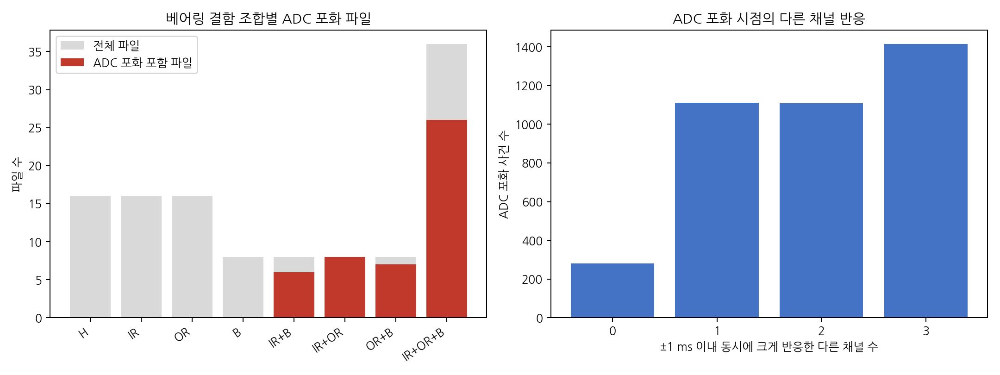
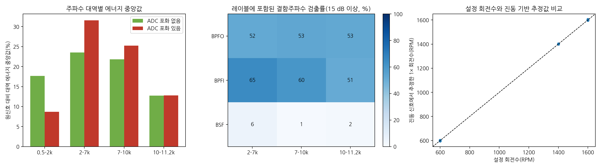

# UOS v2 현재 수집 데이터 판단

- 검토일: 2026-08-03
- 분석 대상: 중복 제외 TDMS 116개
- 채널 기록 수: 116파일 × 4채널 = 464개
- 주요 목적: ADC 포화 영향, 결함주파수 검출 범위, 본 수집 진행 가능성 판단

## 1. 최종 판단

- NI-9234 약 ±5.12 V 입력 한계에서 실제 ADC 포화 발생 확인됨
- 포화 사건의 대부분에서 다른 채널도 같은 시각에 크게 반응함
- 단일 채널의 우발적 전기 잡음만으로 설명하기 어려운 결과임
- 30204의 1600 RPM 단일 IR·OR 조건에서 BPFI·BPFO가 비교적 안정적으로 검출됨
- B 또는 roller 결함의 BSF는 단일 B 조건에서도 검출되지 않아 물리 검증 미완료 상태임
- 후속 S1 기반 확장 분석에서 단일 B의 `2×BSF−FTF`가 65.6% 검출되어 기본 BSF만으로 판단한 기존 분석의 한계 확인됨
- 상세 고조파·측파대 결과: `compound_feature_and_task_b_analysis_ko.md` 참고
- 6204와 N204는 현재 IR+OR+B 파일만 존재하여 단일 결함 대조 불가능함
- ADC 포화 여부만으로 복합 결함을 높은 정확도로 구분할 수 있어 학습 지름길 위험 존재함
- 현재 자료의 파일럿 분석 활용은 가능하나 현 설정 그대로 본 수집 확정은 부적절함

## 2. 현재 파일 구성

### 2.1 베어링별 구성

| 베어링 | 형식 | 현재 파일에 포함된 RPM | 현재 결함 구성 |
|---|---|---|---|
| 30204 | 테이퍼 롤러 베어링 | 600, 1400, 1600 | H, IR, OR, B, IR+B, IR+OR, OR+B, IR+OR+B |
| 6204 | 깊은 홈 볼 베어링 | 1400, 1600 | IR+OR+B만 존재함 |
| N204 | 원통 롤러 베어링 | 1400, 1600 | IR+OR+B만 존재함 |

### 2.2 `H` 레이블의 정확한 의미

- `H`의 의미: 베어링에 인위적 결함을 부여하지 않은 상태임
- `H` 파일 수: 30204에서만 16개 존재함
- `H` 파일의 RPM: 600 RPM 8개, 1600 RPM 8개 구성임
- 각 RPM의 로터 조건: `H`, `L`, `M1`, `M2`, `M3`, `U1`, `U2`, `U3` 포함됨
- `H_H`: 베어링 정상·로터 정상 조건임
- `L_H`: 베어링 정상·로터 풀림 조건임
- `M1_H`~`M3_H`: 베어링 정상·로터 오정렬 조건임
- `U1_H`~`U3_H`: 베어링 정상·로터 불평형 조건임
- 따라서 `fault=H` 16파일을 “기계 전체 정상 조건”으로 부르는 것은 부정확함
- 본 문서에서는 `베어링 정상(H)`으로 표기함

## 3. ADC 포화 전수 검사

- 전체 표본 수: 2,535,751,736개
- 정확한 ADC 포화 표본 수: 4,709개
- 전체 표본 대비 비율: 0.0001857%
- ADC 포화 포함 파일: 47/116개
- 최장 연속 포화: 3표본, 약 117 μs
- 최악 채널: `N204/1400 RPM/M3/IR+OR+B/CH0`
- 최악 채널의 포화 비율: 0.01485%
- 저장값의 반복 한계: 채널 감도를 전압으로 환산할 경우 약 ±5.12 V
- 직접적인 저장 한계 지점: NI-9234 입력 또는 ADC rail로 판단됨 [CLIP-E01]

### 해석

- 포화 비율이 매우 작다는 사실만으로 영향이 작다고 판단할 수 없음
- 포화 표본이 최대 충격 위치에 집중되므로 peak, crest factor, kurtosis에 직접 영향 가능함
- 포화로 손실된 실제 최대 가속도의 복원 불가능함
- 50 g 초과 구간은 13A131 명목 측정범위 밖이므로 비포화 표본도 절대진폭 정확도 미보증 상태임

## 4. ADC 포화 시점의 채널 간 반응

### 4.1 오른쪽 그래프의 계산 방법

- 연속된 ADC 포화 표본을 하나의 포화 사건으로 통합함
- 통합된 포화 사건 수: 3,913건
- 한 채널의 포화 시점을 기준으로 앞뒤 1 ms 구간 확인함
- 나머지 세 채널에서 각 채널 자체의 절대진폭 상위 0.1%를 넘는 반응 수 계산함
- `0`: 나머지 세 채널 모두 큰 반응 없음
- `1`: 다른 한 채널에서 큰 반응 발생함
- `2`: 다른 두 채널에서 큰 반응 발생함
- `3`: 나머지 세 채널 모두 큰 반응 발생함

| 크게 반응한 다른 채널 수 | 사건 수 | 전체 포화 사건 대비 비율 |
|---:|---:|---:|
| 0 | 280 | 7.2% |
| 1 | 1,110 | 28.4% |
| 2 | 1,108 | 28.3% |
| 3 | 1,415 | 36.2% |

### 4.2 오른쪽 그래프의 의미

- 다른 채널이 하나 이상 함께 크게 반응한 사건: 3,633/3,913건, 92.8%
- 다른 채널이 둘 이상 함께 크게 반응한 사건: 2,523/3,913건, 64.5%
- 포화가 특정 센서 한 개에서만 발생한 우발적 전기 스파이크일 가능성 감소함
- 공통 기계 충격 또는 구조물을 통한 충격 전달 가능성 증가함
- 동일 시각 반응만으로 실제 베어링 충격과 센서 부착 공진을 분리할 수는 없음 [CLIP-E02]

## 5. ADC 포화와 베어링 결함 레이블의 관계

### 5.1 왼쪽 그래프의 구성

- 회색 막대: 각 베어링 결함 레이블의 전체 파일 수
- 빨간색 막대: 해당 레이블에서 ADC 포화가 한 번 이상 발생한 파일 수
- `H`: 베어링 정상이며 로터 조건은 정상·풀림·오정렬·불평형을 모두 포함함
- `IR`, `OR`, `B`: 베어링 단일 결함 조건임
- `IR+B`, `IR+OR`, `OR+B`: 베어링 2중 복합 결함 조건임
- `IR+OR+B`: 베어링 3중 복합 결함 조건임

| 베어링 결함 레이블 | 전체 파일 | ADC 포화 파일 |
|---|---:|---:|
| H | 16 | 0 |
| IR | 16 | 0 |
| OR | 16 | 0 |
| B | 8 | 0 |
| IR+B | 8 | 6 |
| IR+OR | 8 | 8 |
| OR+B | 8 | 7 |
| IR+OR+B | 36 | 26 |

### 5.2 학습 지름길 위험

- 베어링 정상·단일 결함 파일: 총 56개, ADC 포화 파일 0개
- 베어링 복합 결함 파일: 총 60개, ADC 포화 파일 47개
- 단순 규칙: ADC 포화가 있으면 복합 결함으로 판정함
- 전체 116파일 정확도: 103/116 = 88.8%
- 전체 precision: 47/47 = 100%
- 전체 recall: 47/60 = 78.3%
- 조건 구성이 균형적인 30204·1600 RPM 64파일 정확도: 95.3%
- 30204·1600 RPM precision: 100%
- 30204·1600 RPM recall: 90.6%
- 모델이 결함주파수 대신 포화 흔적을 이용할 가능성 높음 [CLIP-E06]

## 6. 회전수 확인

### 6.1 오른쪽 그래프의 계산 방법

- 각 파일의 첫 30초 사용함
- 각 채널에서 설정 회전수의 ±10% 범위 내 1× 회전성분 후보 탐색함
- 네 채널 후보값의 중앙값을 파일별 대표 회전수로 사용함
- 점선: 설정 회전수와 추정 회전수가 완전히 일치하는 기준선임
- 한 점: 파일 하나를 의미함
- 같은 RPM의 파일이 거의 같은 위치에 겹쳐 있어 실제 점 개수보다 적게 보임

| 설정 RPM | 파일 수 | 추정 최솟값 | 추정 중앙값 | 추정 최댓값 |
|---:|---:|---:|---:|---:|
| 600 | 32 | 596.25 | 600.00 | 603.75 |
| 1400 | 12 | 1398.75 | 1398.75 | 1402.50 |
| 1600 | 72 | 1597.50 | 1601.25 | 1605.00 |

### 6.2 해석

- 116파일 모두 설정 회전수와 큰 차이 없는 1× 후보 확인됨
- 네 채널 일치도와 피크 분리도를 기준으로 High 115파일, Medium 1파일 판정됨
- 모터 속도가 설정값에서 크게 벗어난 증거 없음
- 타코미터 실측값이 아니라 진동 신호에서 추정한 후보값임
- 최종 데이터셋의 회전수 기준값으로 직접 사용할 수 없음 [CLIP-E03]

## 7. 결함주파수 검출 조건

- 분석 구간: 각 파일의 처음 10초
- 대상 채널: 네 채널 모두 개별 분석함
- 포락선 carrier 대역: 2–7 kHz, 7–10 kHz, 10–11.2 kHz
- 판정 대상: BPFO, BPFI, BSF
- 판정 기준: 계산 결함주파수 주변 피크가 주변 배경의 중앙값보다 15 dB 이상 높음
- 결함주파수 계산 기준: UOS v1 원논문 p. 6 Table 2의 베어링 geometry 사용함
- UOS v2 실물 베어링의 제조사·suffix·내부 geometry 일치 여부는 미확인 상태임

## 8. 2–7 kHz 대역의 베어링·RPM·결함별 결과

### 8.1 OR 결함의 BPFO 검출

| 베어링 | RPM | OR가 포함된 베어링 결함 조건 | 검출 채널/분석 채널 |
|---|---:|---|---:|
| 30204 | 600 | OR, IR+OR+B | 49/64 |
| 30204 | 1400 | IR+OR+B | 7/16 |
| 30204 | 1600 | OR, OR+B, IR+OR, IR+OR+B | 78/128 |
| 6204 | 1400 | IR+OR+B | 2/16 |
| 6204 | 1600 | IR+OR+B | 6/16 |
| N204 | 1400 | IR+OR+B | 0/16 |
| N204 | 1600 | IR+OR+B | 0/16 |

#### 30204·1600 RPM 세부 결과

| 베어링 결함 조건 | 파일 수 | 채널 수 | BPFO 검출 채널 |
|---|---:|---:|---:|
| OR | 8 | 32 | 31/32 |
| OR+B | 8 | 32 | 31/32 |
| IR+OR | 8 | 32 | 9/32 |
| IR+OR+B | 8 | 32 | 7/32 |

#### 판단

- 가장 강한 BPFO 검출 근거: 30204·1600 RPM의 단일 OR와 OR+B 조건임
- 30204·1600 RPM의 IR+OR 및 IR+OR+B에서는 BPFO 검출률 감소함
- N204에서는 1400·1600 RPM 모두 BPFO 미검출 상태임
- 모든 베어링을 합친 `142/272`만으로 OR 검증 성공을 주장하면 안 됨

### 8.2 IR 결함의 BPFI 검출

| 베어링 | RPM | IR가 포함된 베어링 결함 조건 | 검출 채널/분석 채널 |
|---|---:|---|---:|
| 30204 | 600 | IR, IR+OR+B | 43/64 |
| 30204 | 1400 | IR+OR+B | 6/16 |
| 30204 | 1600 | IR, IR+B, IR+OR, IR+OR+B | 110/128 |
| 6204 | 1400 | IR+OR+B | 7/16 |
| 6204 | 1600 | IR+OR+B | 5/16 |
| N204 | 1400 | IR+OR+B | 4/16 |
| N204 | 1600 | IR+OR+B | 2/16 |

#### 30204·1600 RPM 세부 결과

| 베어링 결함 조건 | 파일 수 | 채널 수 | BPFI 검출 채널 |
|---|---:|---:|---:|
| IR | 8 | 32 | 28/32 |
| IR+B | 8 | 32 | 30/32 |
| IR+OR | 8 | 32 | 30/32 |
| IR+OR+B | 8 | 32 | 22/32 |

#### 판단

- 가장 강한 BPFI 검출 근거: 30204·1600 RPM의 IR, IR+B, IR+OR 조건임
- 30204·1600 RPM의 IR+OR+B에서도 22/32채널 검출됨
- 6204와 N204는 IR+OR+B만 존재하므로 단일 IR 대조 불가능함
- 모든 베어링을 합친 `177/272`만으로 IR 검증 성공을 주장하면 안 됨

### 8.3 B 또는 roller 결함의 BSF 검출

| 베어링 | RPM | B가 포함된 베어링 결함 조건 | 검출 채널/분석 채널 |
|---|---:|---|---:|
| 30204 | 600 | IR+OR+B | 0/32 |
| 30204 | 1400 | IR+OR+B | 0/16 |
| 30204 | 1600 | B, IR+B, OR+B, IR+OR+B | 8/128 |
| 6204 | 1400 | IR+OR+B | 0/16 |
| 6204 | 1600 | IR+OR+B | 6/16 |
| N204 | 1400 | IR+OR+B | 0/16 |
| N204 | 1600 | IR+OR+B | 0/16 |

#### 30204·1600 RPM 세부 결과

| 베어링 결함 조건 | 파일 수 | 채널 수 | BSF 검출 채널 |
|---|---:|---:|---:|
| B | 8 | 32 | 0/32 |
| IR+B | 8 | 32 | 8/32 |
| OR+B | 8 | 32 | 0/32 |
| IR+OR+B | 8 | 32 | 0/32 |

#### 판단

- 30204 단일 B에서 BSF 미검출됨
- 전체 14건의 검출도 30204 IR+B 8건과 6204·1600 RPM IR+OR+B 6건으로만 구성됨
- B 또는 roller 결함의 물리 검증 완료 주장 불가능함
- BSF 기본주파수 외 2×BSF·3×BSF·BSF±FTF 측파대 추가 분석 필요함
- rolling-element slip을 고려한 탐색 허용범위 재검토 필요함
- B 단일 결함과 베어링 정상(H)의 직접 대조 필요함
- 후속 확장 분석에서 30204·1600 RPM 단일 B의 `2×BSF−FTF`가 21/32채널에서 검출됨
- B 결함 검증은 기본 BSF가 아닌 BSF 고조파·FTF 측파대까지 포함해야 함
- 다른 결함 계열과 주파수 탐색 창이 겹치는 후보는 독립 증거에서 제외해야 함

## 9. 가운데 결함주파수 검출률 그래프 설명

- 행: BPFO, BPFI, BSF 구분임
- 열: 포락선 생성에 사용한 2–7 kHz, 7–10 kHz, 10–11.2 kHz carrier 대역임
- 셀 숫자: 해당 결함이 레이블에 포함된 전체 채널 중 15 dB 기준을 넘은 비율임
- BPFO 분모: OR가 포함된 30204·6204·N204의 모든 분석 채널 272개임
- BPFI 분모: IR가 포함된 30204·6204·N204의 모든 분석 채널 272개임
- BSF 분모: B가 포함된 30204·6204·N204의 모든 분석 채널 240개임
- 서로 다른 베어링·RPM·단일/복합 결함·로터 조건을 합산한 요약값임
- 베어링별 성능 또는 특정 조건의 검출 성능으로 해석하면 안 됨
- BPFO: 세 carrier 대역 모두 약 52~53% 검출됨
- BPFI: 2–7 kHz 65%, 7–10 kHz 60%, 10–11.2 kHz 51% 검출됨
- BSF: 모든 carrier 대역에서 6% 이하 검출됨
- 조건별 근거는 앞의 2–7 kHz 세부 표를 우선 사용해야 함

## 10. 왼쪽 대역 에너지 그래프 설명

- 분석 구간: 각 파일의 첫 10초임
- 초록색: ADC 포화가 한 번도 없는 69파일의 276채널 기록 중앙값임
- 빨간색: ADC 포화가 한 번 이상 있는 47파일의 188채널 기록 중앙값임
- 각 값: 해당 대역으로 필터링한 신호의 제곱평균을 중심화 원신호 제곱평균으로 나눈 비율임
- ADC 포화 파일의 2–7 kHz 중앙값: 31.6%
- ADC 포화 파일의 7–10 kHz 중앙값: 25.3%
- ADC 포화 파일의 10–11.2 kHz 중앙값: 12.8%
- ADC 포화 파일의 0.5–2 kHz 중앙값: 8.7%
- 포화 파일이 2–10 kHz 진동 에너지가 상대적으로 큰 조건에 집중됨
- 이미 포화된 신호에 필터를 적용한 결과이므로 포화 이전 에너지 복원값이 아님
- 필터 경계와 과도응답 영향 때문에 네 막대 합을 정확히 100%로 해석하면 안 됨
- 기존의 “신호 43%가 7 kHz 밖에 있음”을 뒷받침하는 그래프가 아님 [CLIP-E05]

## 11. 베어링 정상(H) 대조 결과

- 대상: 30204의 베어링 정상(H) 16파일, 64채널임
- RPM 구성: 600 RPM 8파일, 1600 RPM 8파일임
- 로터 구성: 각 RPM에서 H, L, M1, M2, M3, U1, U2, U3 한 파일씩 포함됨
- 2–7 kHz에서 BPFO 15 dB 오검출: 1/64채널임
- 2–7 kHz에서 BPFI 15 dB 오검출: 0/64채널임
- 2–7 kHz에서 BSF 15 dB 오검출: 0/64채널임
- 7–10 kHz와 10–11.2 kHz에서 세 결함주파수 오검출: 0/64채널임
- 베어링 결함주파수 판정의 낮은 오검출률을 보여 주는 결과임
- 로터 결함이 없는 완전 정상 기계 64채널의 결과로 해석하면 안 됨

## 12. 포화 사건의 결함주기 분석

- 분석 대상: 포화 사건이 5개 이상인 채널 42개임
- 비교 주파수: 1×, FTF, BSF, BPFO, BPFI임
- 위상 집중도 중앙값: 0.112~0.193으로 낮음
- 근사 `p<0.01`: 1× 4개, BSF 2개, BPFO 1개, BPFI 1개 채널임
- 포화 사건 자체가 특정 결함주기의 일정 위상에 고정된다는 일반적 증거 부족함
- 포화 threshold를 넘은 일부 충격만 사용한 분석이라는 한계 존재함
- 결함주기 연관성 판단에는 포락선 결과를 우선 사용함 [CLIP-E07]

## 13. 현재 데이터로 판단할 수 없는 항목

- 포화 이전 실제 최대 가속도 확인 불가능함
- 실제 peak가 55 g인지 100 g 이상인지 구분 불가능함
- 13A131의 ±50 g 밖 진폭 선형성 확인 불가능함
- 현재 부착 방식이 고주파 진폭을 얼마나 증폭했는지 분리 불가능함
- 포화가 없었을 때의 peak·crest factor·kurtosis 복원 불가능함
- UOS v2 실물 베어링 geometry와 UOS v1 Table 2의 완전 일치 여부 미확인 상태임

## 14. 장비 추가 없이 수행할 재시험

- 최악 조건: `N204/1600 RPM/M3/IR+OR+B` 선정함
- 대조 조건: 같은 N204·1600 RPM·M3 로터 조건에서 베어링 정상(H) 사용이 가장 적절함
- 현재 폴더에는 해당 N204 베어링 정상 대조 파일이 없으므로 신규 대조 측정 필요함
- 동일 센서·DAQ로 완전 분리 후 재부착 3회 수행 필요함
- 센서 개체와 DAQ 채널 연결 교차 필요함
- 물리 위치·센서 개체·DAQ 입력 채널 중 peak를 따라가는 요인 확인 필요함
- stud 부착 부품 보유 시 현재 부착 방식과 동일 조건 비교 필요함
- 각 반복의 포화 수, 대역 RMS, BPFO·BPFI·BSF, 포화 전후 baseline 비교 필요함
- 신규 전체 수집 전 타코미터 또는 동등한 회전 기준 저장 필요함

## 15. 사용 가능 범위

| 사용 목적 | 현재 판단 |
|---|---|
| 장비 동작과 4채널 반응 파일럿 | 사용 가능함 |
| 30204·1600 RPM의 BPFI·BPFO 확인 | 조건부 사용 가능함 |
| 6204·N204의 단일 결함 물리 검증 | 현재 자료로 불가능함 |
| B 또는 roller 결함의 BSF 검증 | 현재 자료로 불충분함 |
| 절대 peak·severity·crest factor·kurtosis 비교 | 사용 부적합함 |
| 고주파 절대진폭 비교 | 사용 부적합함 |
| 원신호 기반 복합 결함 ML benchmark | 학습 지름길 통제 전 사용 부적합함 |
| 전체 데이터 수집 설정 확정 | 반복·재부착·교차시험 전 보류 필요함 |

## 16. 근거 파일

| Evidence ID | 근거 파일 |
|---|---|
| CLIP-E01 | `results/clipping_scan_file.csv`, `clipping_scan_channel.csv`, `rail_values.csv` |
| CLIP-E02 | `results/rail_event_cross_channel.csv` |
| CLIP-E03 | `results/one_x_candidates.csv` |
| CLIP-E04 | `results/envelope_validation_10s.csv` |
| CLIP-E05 | `results/band_metrics_10s.csv` |
| CLIP-E06 | `results/clipping_label_association.csv`, `clipping_scan_file.csv` |
| CLIP-E07 | `results/rail_event_periodicity.csv` |

## 17. 재현 코드

- 전수·확장 분석: `scripts/analyze_uos_v2_clipping_extended.py`
- 그림 생성: `scripts/plot_uos_v2_clipping_extended.py`
- 원시 TDMS 수정 없음
- 모든 대역 분석에 파일별 첫 10초 사용함
- 이미 포화된 신호의 실제 진폭 복원을 목적으로 하지 않음
