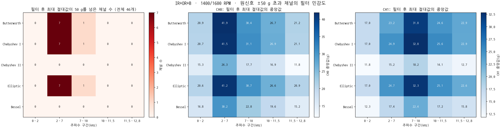
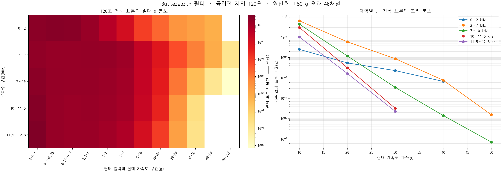
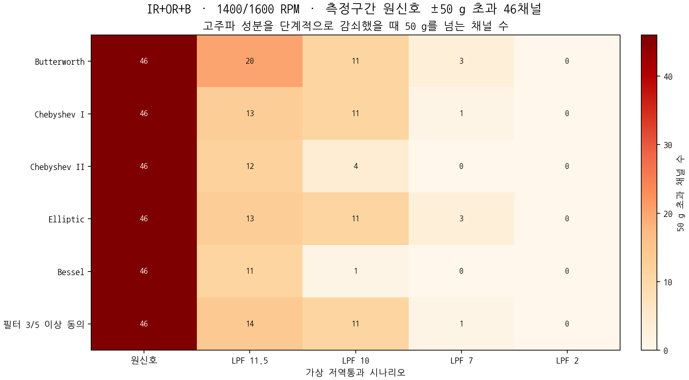
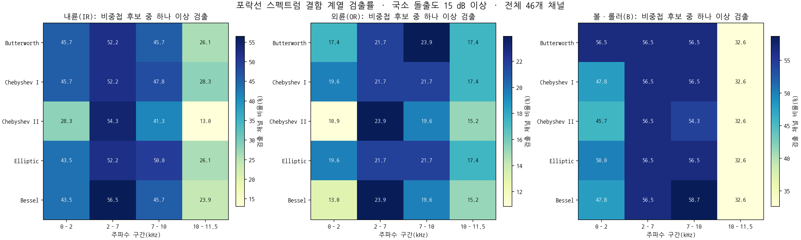

# UOS v2 다중 필터·주파수 구간 분석

- 작성일: 2026-08-03
- 분석 목적: ±50 g 초과가 어느 주파수 구간과 관련되는지 확인하고, 같은 결론이 필터 종류를 바꿔도 유지되는지 점검함
- 분석 대상: 30204·6204·N204 베어링, 1400·1600 RPM, 베어링 `IR+OR+B` 3중 결함 조건임
- 선택 기준: 원신호 최대값이 +50 g를 넘거나 최소값이 −50 g보다 작은 채널임
- 유효 측정구간: 일반 파일 60~180초, 30204 장시간 파일 300~420초임
- 대상 규모: 26개 파일·46개 채널임
- 채널 구성: CH0 25개·CH1 21개임
- 원자료 보존: TDMS 파일을 수정하지 않고 파생 CSV와 그림만 생성함

## 1. 먼저 내릴 수 있는 판단

- 분석 대상 46채널 중 44채널이 ADC의 같은 디지털 레일에 실제 도달함
- 이미 잘린 파형이므로 필터 이전의 실제 순간 진폭과 정확한 주파수별 진폭 복원 불가능함
- 공회전 제외 120초 전체에서 Butterworth·Chebyshev I·Elliptic 적용 시 2~7 kHz 7채널, 7~10 kHz 1채널의 필터 출력 최대값이 50 g를 넘음
- Chebyshev II와 Bessel에서는 모든 주파수 구간의 필터 출력 최대값이 50 g 이하임
- 2~7 kHz Butterworth 결과에서 50 g 초과 표본은 141,312,000개 중 22개로 약 0.0000156%임
- 7~10 kHz Butterworth 결과에서 50 g 초과 표본은 141,312,000개 중 1개로 약 0.0000007%임
- 50 g 초과는 지속적인 고진폭 대역 신호가 아니라 극히 드문 필터 출력 peak에 해당함
- 같은 데이터라도 필터에 따라 최대값이 크게 달라지므로 필터 후 50 g 기준은 물리적 센서 입력 범위 판정값으로 사용할 수 없음
- 2~7 kHz는 내륜(IR)·외륜(OR) 결함 계열 검출이 가장 일관된 구간임
- 7~10 kHz는 볼·롤러(B) 결함 계열 검출이 가장 높은 구간임
- 10~11.5 kHz에서는 결함 계열 검출률이 감소함
- 11.5~12.8 kHz는 NI-9234의 alias-free 대역 경계 밖에 가까운 전이 구간이므로 에너지 분포 확인에만 사용함
- 포락선 스펙트럼 결함 판정에서는 11.5~12.8 kHz 구간을 제외함
- 이번 결과만으로 ±50 g 센서 유지·교체를 결정할 수 없음

## 2. 분석 대상의 세부 구성

| 베어링 | 형식 | RPM | 원신호 ±50 g 초과 채널 | 해당 파일 수 |
|---|---|---:|---:|---:|
| 30204 | 테이퍼 롤러 베어링 | 1400 | 4 | 4 |
| 30204 | 테이퍼 롤러 베어링 | 1600 | 16 | 8 |
| 6204 | 깊은 홈 볼 베어링 | 1400 | 3 | 2 |
| 6204 | 깊은 홈 볼 베어링 | 1600 | 7 | 4 |
| N204 | 원통 롤러 베어링 | 1400 | 8 | 4 |
| N204 | 원통 롤러 베어링 | 1600 | 8 | 4 |
| 합계 | 3개 형식 | 2개 RPM | 46 | 26 |

- 조건별 채널 수가 서로 다름
- ±50 g를 넘은 채널만 선택한 자료임
- 베어링 형식별 포화 발생률이나 우열을 직접 비교하는 표본으로 사용 불가능함

## 3. 적용한 주파수 구간

| 구간 | 필터 형태 | 사용 목적 | 물리 해석 범위 |
|---|---|---|---|
| 0~2 kHz | 저역통과 | 저주파 진동·회전 관련 성분 포함 구간 확인 | 센서 명목 대역 안임 |
| 2~7 kHz | 대역통과 | 기존 Task B의 7 kHz 이하 구간을 분리하고 포락선 carrier로 확인 | 센서 명목 대역 안임 |
| 7~10 kHz | 대역통과 | 센서 명목 상한까지의 고주파 충격 성분 확인 | 센서 명목 대역 안임 |
| 10~11.5 kHz | 대역통과 | 센서 명목 10 kHz 바깥의 응답 확인 | 센서 명목 범위 밖이므로 절대진폭 해석 제한됨 |
| 11.5~12.8 kHz | 고역통과 | Nyquist 인접 성분과 DAQ 전이 대역 진단 | 결함 물리 검증에 사용하지 않음 |

- 샘플링 레이트: 25.6 kS/s임
- Nyquist 주파수: 12.8 kHz임
- NI-9234 alias-free bandwidth의 근사 경계: `0.45×25.6 kHz=11.52 kHz`임
- 11.5~12.8 kHz는 anti-aliasing 필터 전이와 Nyquist 인접 영향이 섞일 수 있음

## 4. 적용한 필터

| 필터 | 설정 | 이번 분석에서의 역할 |
|---|---|---|
| Butterworth | 4차, 최대 평탄 응답 | 주 판정용 기준 필터임 |
| Chebyshev I | 4차, 통과대역 ripple 0.5 dB | 통과대역 ripple에 대한 민감도 확인함 |
| Chebyshev II | 4차, 저지대역 감쇠 40 dB | 저지대역 ripple·경계 정의 차이에 대한 민감도 확인함 |
| Elliptic | 4차, 통과대역 ripple 0.5 dB·저지대역 감쇠 40 dB | 가파른 전이 특성에 대한 민감도 확인함 |
| Bessel | 4차, phase normalization | 완만한 진폭 응답을 가진 필터에 대한 민감도 확인함 |

- 모든 필터를 second-order sections(SOS) 형태로 설계함
- 모든 필터를 정방향·역방향으로 적용하여 위상 이동을 제거함
- 표의 4차는 한 방향 필터 차수이며, 정방향·역방향 적용으로 진폭 응답 효과가 두 번 적용됨
- 필터마다 차단주파수의 수학적 정의와 전이대역 폭이 다름
- 같은 차수와 같은 숫자의 차단주파수를 넣어도 출력 진폭이 같아지지 않음
- 필터 간 최대값 차이를 실제 기계 진동 차이로 해석하지 않음
- Butterworth 결과를 주 결과로 사용하고 나머지는 결론의 민감도 점검에 사용함

### 추가 후보 `+α` 처리

- SciPy 공식 신호처리 문서에서 Butterworth·Chebyshev I·Chebyshev II·Elliptic·Bessel은 명확한 필터 계열과 구현이 확인됨 [FILTER-S01]
- 작업 메모의 `+α`는 특정한 `alpha filter` 명칭이 아니라 추가 후보를 더 조사한다는 표기로 우선 해석함
- 따라서 이름이 불명확한 필터를 임의 구현하지 않음
- `+α`가 실제 특정 필터를 뜻한 것이라면 정확한 명칭·식·참고문헌 확인이 필요함

## 5. 신호 구간과 계산값

### 5.1 주 분포 분석

- 일반 파일은 60~180초, 30204·7분 초과 파일은 300~420초 전체를 사용함
- 채널당 분석 표본: 3,072,000개임
- 분석 대상 46채널의 대역별 전체 표본: 141,312,000개임
- 각 필터·각 주파수 구간에 대해 다음 값을 계산함
  - 절대 최대값임
  - 평균 절대값과 절대값 중앙값임
  - p90·p95·p99임
  - 절대값 상위 0.1% 경계인 p99.9임
  - 절대값 상위 0.01% 경계인 p99.99임
  - RMS임
  - crest factor임
  - 10·20·30·40·50 g 초과 표본 수와 비율임
  - 원신호 120초 RMS 제곱 대비 대역 RMS 제곱 비율임
- 최대값만으로 순간 spike를 일반적인 진동 수준으로 오인하지 않도록 p99.9·p99.99·RMS를 함께 저장함

### 5.2 보조 10초 분석

- 유효 120초에서 원신호 절대값이 가장 큰 표본을 찾음
- 해당 표본을 포함하는 10초만 포락선 분석과 누적 저역통과 시나리오에 사용함
- 10초 결과를 120초 전체의 g값 분포로 해석하지 않음

## 6. 주파수 구간별 50 g 초과 결과



### 그래프 읽는 방법

- 왼쪽 표의 행: 사용한 필터 종류임
- 왼쪽 표의 열: 주파수 구간임
- 왼쪽 셀의 숫자: 필터 후 절대 최대값이 50 g를 넘은 채널 수임
- 분석 대상 분모: 모든 셀에서 46채널임
- 가운데 셀의 숫자: CH0에서 계산한 필터 후 최대 절대값의 중앙값임
- 오른쪽 셀의 숫자: CH1에서 계산한 필터 후 최대 절대값의 중앙값임
- 각 중앙값은 해당 채널에 속한 여러 베어링·RPM·로터 조건의 최대값을 크기순으로 놓았을 때 중앙에 해당하는 값임
- CH0와 CH1을 분리하여 센서 위치·채널에 따른 대역별 진폭 차이를 확인하도록 구성함

| 필터 | 0~2 kHz | 2~7 kHz | 7~10 kHz | 10~11.5 kHz | 11.5~12.8 kHz |
|---|---:|---:|---:|---:|---:|
| Butterworth | 0 | 7 | 1 | 0 | 0 |
| Chebyshev I | 0 | 7 | 1 | 0 | 0 |
| Chebyshev II | 0 | 0 | 0 | 0 | 0 |
| Elliptic | 0 | 7 | 1 | 0 | 0 |
| Bessel | 0 | 0 | 0 | 0 | 0 |

### Butterworth에서 50 g를 넘은 조건

| 주파수 구간 | 베어링 | RPM | 로터 | 채널 | 대역 peak | p99.99 | 50 g 초과 표본 |
|---|---|---:|---|---|---:|---:|---:|
| 2~7 kHz | N204 | 1400 | H | CH0 | 54.69 g | 38.97 g | 2개 |
| 2~7 kHz | N204 | 1400 | L | CH0 | 53.33 g | 38.49 g | 3개 |
| 2~7 kHz | N204 | 1400 | U3 | CH0 | 56.16 g | 38.24 g | 3개 |
| 2~7 kHz | N204 | 1600 | H | CH0 | 54.79 g | 36.88 g | 6개 |
| 2~7 kHz | N204 | 1600 | L | CH0 | 52.24 g | 35.73 g | 2개 |
| 2~7 kHz | N204 | 1600 | U3 | CH0 | 53.59 g | 37.46 g | 5개 |
| 2~7 kHz | 30204 | 1400 | L | CH0 | 53.98 g | 15.59 g | 1개 |
| 7~10 kHz | 30204 | 1600 | H | CH0 | 51.40 g | 25.19 g | 1개 |

### 해석

- 120초 전체를 사용하자 원신호 최대 peak 주변 10초에서 놓쳤던 다른 시각의 대역별 peak가 추가로 확인됨
- 원신호 최대값 시점과 특정 대역의 필터 출력 최대값 시점이 반드시 같지 않음을 보여 줌
- 2~7 kHz의 50 g 초과 22표본과 7~10 kHz의 1표본은 전체 분포에서 극히 드문 꼬리 사건임
- 같은 원자료에서도 Butterworth·Chebyshev I·Elliptic과 Chebyshev II·Bessel의 50 g 판정이 달라짐
- 이미 잘린 파형 주변에서 필터가 만든 재구성 진동과 경계 응답이 포함됨
- 필터 후 최대값을 센서 입력단의 실제 대역별 진폭으로 사용하면 안 됨

## 6.1 주파수 대역별 g값 분포



- 아래 표는 Butterworth 결과임
- RMS·p99.9·peak 중앙값은 46개 채널별 값의 중앙값임
- 10~50 g 초과율은 46채널의 120초 표본을 합친 비율임
- 모든 채널의 기록 길이가 같아 채널별 표본 가중치는 동일함

| 주파수 구간 | RMS 중앙값 | p99.9 중앙값 | peak 중앙값 | >10 g | >20 g | >30 g | >40 g | >50 g |
|---|---:|---:|---:|---:|---:|---:|---:|---:|
| 0~2 kHz | 0.52 g | 4.01 g | 18.62 g | 0.0252% | 0.00543% | 0.00228% | 0.000671% | 0% |
| 2~7 kHz | 1.76 g | 12.52 g | 33.85 g | 0.6355% | 0.0590% | 0.00874% | 0.000766% | 0.0000156% |
| 7~10 kHz | 1.68 g | 12.98 g | 31.51 g | 0.4348% | 0.0119% | 0.000340% | 0.0000142% | 0.0000007% |
| 10~11.5 kHz | 1.20 g | 9.70 g | 25.80 g | 0.2987% | 0.00315% | 0.0000318% | 0% | 0% |
| 11.5~12.8 kHz | 1.10 g | 8.09 g | 21.32 g | 0.1016% | 0.00164% | 0.0000226% | 0% | 0% |

### 분포 해석

- 전형적 크기를 나타내는 RMS와 p99.9는 2~7·7~10 kHz에서 가장 큼
- 50 g 초과는 2~7 kHz와 7~10 kHz에서만 나타나지만 비율은 각각 약 0.0000156%와 0.0000007%임
- 10 kHz 위 대역도 RMS와 p99.9가 0은 아니므로 고주파 에너지가 완전히 없다는 뜻은 아님
- 10 kHz 위에서는 Butterworth 출력이 50 g를 넘지 않았음
- `11.5~12.8 kHz`는 NI-9234 전이대역에 가까우므로 물리적 결함 진폭으로 해석하지 않음
- 표본을 합친 분포는 선택된 ±50 g 초과 3중 결함 채널의 분포이며 전체 UOS v2 조건의 일반 분포가 아님

## 7. 고주파 성분을 줄이는 누적 저역통과 시나리오



### 개별 대역통과와 누적 저역통과의 차이

- 앞 절의 2~7 kHz 결과는 2~7 kHz 구간만 따로 남긴 값임
- 이번 절의 10 kHz 저역통과 결과는 0~10 kHz 성분을 모두 함께 남긴 값임
- 120초 대역통과와 최대충격 주변 10초 누적 저역통과는 분석 구간과 목적이 달라 채널 수를 직접 같게 기대하면 안 됨
- 0~2, 2~7, 7~10 kHz 성분이 같은 시점에 합쳐져 50 g를 넘을 수 있음
- 저역통과는 차단주파수 위 성분을 무한히 날카롭게 완전 삭제하지 않고 전이대역을 두고 감쇠함
- 따라서 아래 결과는 `10 kHz 위를 완전히 0으로 만든 이상적 결과`가 아니라 `10 kHz 저역통과 필터를 적용한 결과`임

### 차단주파수별 50 g 초과 채널 수

| 남긴 누적 범위 | Butterworth | Chebyshev I | Chebyshev II | Elliptic | Bessel | 필터 5종 중 3종 이상 동의 |
|---|---:|---:|---:|---:|---:|---:|
| 원신호 | 46 | 46 | 46 | 46 | 46 | 46 |
| 약 0~11.5 kHz | 20 | 13 | 12 | 13 | 11 | 14 |
| 약 0~10 kHz | 11 | 11 | 4 | 11 | 1 | 11 |
| 약 0~7 kHz | 3 | 1 | 0 | 3 | 0 | 1 |
| 약 0~2 kHz | 0 | 0 | 0 | 0 | 0 | 0 |

### 10 kHz 이상을 줄였을 때의 직접 답변

- 저 한 채널을 제외한 모든 채널이 50 g 안으로 들어오는 결과가 아님
- Butterworth 기준 11채널이 여전히 50 g를 넘음
- Chebyshev I 기준 11채널이 여전히 50 g를 넘음
- Chebyshev II 기준 4채널이 여전히 50 g를 넘음
- Elliptic 기준 11채널이 여전히 50 g를 넘음
- Bessel 기준 1채널이 여전히 50 g를 넘음
- 필터 5종 중 3종 이상이 동의한 채널은 11개임
- 필터 종류에 따라 1~11채널로 차이가 크므로 단일 필터 결과만으로 장비 범위 결정 불가능함

### 10 kHz 저역통과 후 필터 3종 이상이 50 g 초과에 동의한 11조건

| 베어링 | RPM | 로터 조건 | 베어링 결함 | 채널 |
|---|---:|---|---|---|
| N204 | 1400 | H | IR+OR+B | CH0 |
| N204 | 1400 | L | IR+OR+B | CH0 |
| N204 | 1400 | M3 | IR+OR+B | CH0 |
| N204 | 1400 | U3 | IR+OR+B | CH0 |
| N204 | 1600 | H | IR+OR+B | CH0 |
| N204 | 1600 | L | IR+OR+B | CH0 |
| N204 | 1600 | M3 | IR+OR+B | CH0 |
| N204 | 1600 | U3 | IR+OR+B | CH0 |
| 6204 | 1600 | H | IR+OR+B | CH0 |
| 30204 | 1600 | H | IR+OR+B | CH0 |
| 30204 | 1600 | L | IR+OR+B | CH0 |

### 7 kHz 이상을 줄였을 때의 결과

- Butterworth·Chebyshev I·Elliptic에서 동일한 1채널만 50 g를 넘음
- 해당 조건: N204·1600 RPM·로터 정상(H)·베어링 IR+OR+B·CH0임
- Chebyshev II와 Bessel에서는 50 g 미만임
- 2~7 kHz 개별 대역통과에서도 50 g를 넘었던 같은 채널임
- 큰 순간 피크의 핵심 기여가 7 kHz 아래, 특히 2~7 kHz에 남아 있다는 정황임

### 해석 제한

- 현재 분석은 최초 원신호가 50 g를 넘은 채널만 선택한 조건부 분석임
- 44/46채널이 이미 ADC rail에 도달한 뒤의 파형임
- 저역통과 후 50 g 미만으로 내려갔다고 해서 실제 센서 입력이 50 g 이내였다는 뜻이 아님
- 저역통과 후에도 50 g를 넘는 결과는 저주파 누적 성분만으로 재구성 출력이 크게 남는다는 뜻임
- 실제 clipping 이전 주파수별 진폭은 현재 데이터로 복원 불가능함

## 8. 포락선 스펙트럼 결함 계열 결과



### 검출 방법

- 각 필터·주파수 구간 신호의 Hilbert envelope를 계산함
- 각 베어링 geometry와 파일별 1× 후보로 BPFO·BPFI·BSF·FTF 계열을 계산함
- 내륜: BPFI 고조파와 `BPFI±1×` 측파대를 확인함
- 외륜: BPFO 고조파를 확인함
- 볼·롤러: BSF 고조파와 `BSF±FTF` 측파대를 확인함
- 예상 주파수 주변 피크가 국소 배경 중앙값보다 15 dB 이상 높을 때 검출로 기록함
- 서로 다른 결함 계열의 검색 범위가 겹치는 후보는 검출 분모와 판정에서 제외함
- 그래프의 각 셀: 해당 결함 계열의 비중첩 후보 중 하나 이상이 15 dB를 넘은 채널 비율임
- 모든 셀의 분모: 46채널임

### 필터 5종에 공통으로 나타난 경향

| 결함 계열 | 가장 일관된 구간 | 필터별 검출률 범위 | 판단 |
|---|---|---:|---|
| 내륜 IR | 2~7 kHz | 52.2~56.5% | BPFI 계열 carrier 후보로 가장 안정적임 |
| 외륜 OR | 2~7 kHz | 21.7~23.9% | 다른 구간보다 높지만 전체 검출률은 낮음 |
| 볼·롤러 B | 7~10 kHz | 54.3~58.7% | BSF·FTF 계열 carrier 후보로 가장 안정적임 |
| 세 계열 동시 | 2~7 kHz | 필터별 3~4채널 | 3중 결함이 모든 채널에서 세 계열을 동시에 보장하지 않음 |

### 필터 다수결 결과

- 한 채널·대역·결함 계열에서 필터 5종 중 3종 이상이 15 dB 검출한 경우를 다수결 검출로 계산함
- 0~2 kHz에서 IR·OR·B 세 계열이 모두 검출된 채널: 4/46개임
- 2~7 kHz에서 IR·OR·B 세 계열이 모두 검출된 채널: 3/46개임
- 7~10 kHz에서 IR·OR·B 세 계열이 모두 검출된 채널: 3/46개임
- 10~11.5 kHz에서 IR·OR·B 세 계열이 모두 검출된 채널: 2/46개임
- 2~7 kHz에서 세 계열 중 하나 이상 검출된 채널: 42/46개임
- 위 결과는 46개의 독립 실험을 의미하지 않음
- 같은 파일의 채널과 같은 장비 조건이 포함되어 통계적 독립성 제한됨

## 9. Task B와 비교한 판단

- 기존 Task B 저역통과 방식은 7 kHz 이하 성분과 7 kHz 초과 성분을 누적해서 비교함
- 이번 방식은 인접 주파수 구간을 따로 분리하여 어느 구간의 기여가 큰지 확인함
- 기존 Task B의 비단조·오버슈트 문제를 필터 5종 비교로 직접 드러냄
- 50 g 초과 여부가 필터 선택에 따라 달라지는 결과 확인함
- 따라서 `7 kHz 저역통과 후 50 g 미만이면 7 kHz 위가 원인`이라는 단일 분기만으로 결론 내리기 어려움
- 2~7 kHz에 물리적 결함 계열이 존재한다는 점과 센서가 정확한 절대진폭을 저장했다는 점은 서로 다른 질문임
- 결함 성분이 보인다고 clipping을 허용해도 된다는 뜻이 아님
- clipping이 있으면 원시 파형·고조파·포락선·모델 입력에 인공적인 성분이 생길 수 있음

## 10. 현재 장비로 다음에 확인할 항목

- 같은 조건을 완전히 정지한 뒤 재가동·재부착하여 3회 이상 반복함
- 센서 개체·DAQ 채널·물리 위치를 교차함
- 필터 분석 대상에 같은 조건의 50 g 미만 채널과 베어링 단일 결함·정상 대조를 포함함
- rail 사건 전후의 짧은 구간을 따로 그려 충격·평탄부·필터 ringing을 확인함
- 원신호 peak와 함께 p99.9·p99.99·RMS·rail sample 수를 판정표에 사용함
- 본 수집 전 허용 가능한 rail sample 수 또는 rail 비율을 수치로 정함
- 절대진폭 정확성이 핵심 요구사항이면 공통 교정 입력 또는 저감도 기준 센서가 필요함

## 11. 생성 파일

| 파일 | 내용 |
|---|---|
| `results/multifilter_band_metrics.csv` | 46채널×5필터×5대역의 120초 최대값·분위수·RMS·crest factor·g 기준 초과율임 |
| `results/multifilter_band_g_histogram.csv` | 전체 및 베어링·RPM별 절대 g 구간의 표본 수와 비율임 |
| `results/multifilter_band_summary.csv` | 필터·대역별 50 g 초과 수와 중앙값 요약임 |
| `results/multifilter_envelope_features.csv` | 0~11.5 kHz의 전체 결함주파수 계열 결과임 |
| `results/multifilter_envelope_summary.csv` | 개별 결함주파수 후보별 검출률 요약임 |
| `results/multifilter_component_summary.csv` | IR·OR·B 계열 중 하나 이상 검출한 채널 비율 요약임 |
| `results/multifilter_cutoff_scenarios.csv` | 필터 5종·저역통과 4종의 채널별 누적 출력 결과임 |
| `results/multifilter_cutoff_scenario_summary.csv` | 필터·차단주파수별 50 g 초과 채널 수 요약임 |
| `results/multifilter_cutoff_consensus_channels.csv` | 채널별 필터 5종의 50 g 판정과 다수결 결과임 |
| `results/multifilter_cutoff_consensus_summary.csv` | 차단주파수별 필터 다수결 요약임 |
| `figures/multifilter_band_peak_summary.png` | 필터별 50 g 초과 수와 CH0·CH1 최대값 중앙값을 분리한 그림임 |
| `figures/multifilter_band_g_distribution.png` | Butterworth 대역별 절대 g histogram과 초과율 그림임 |
| `figures/multifilter_envelope_detection_summary.png` | 필터별 IR·OR·B 계열 검출률 그림임 |
| `figures/multifilter_cutoff_scenario_summary.png` | 고주파 감쇠 단계별 50 g 초과 채널 수 그림임 |

## 12. 재현 명령

```bash
python -m scripts.analyze_uos_v2_multifilter_bands \
  --data-root 'uosv2/수집 데이터' \
  --scan-csv validation/clipping_2026-08-01/results/clipping_scan_channel.csv \
  --one-x-csv validation/clipping_2026-08-01/results/one_x_candidates.csv \
  --output-dir validation/clipping_2026-08-01/results
python -m scripts.plot_uos_v2_multifilter_bands \
  --results-dir validation/clipping_2026-08-01/results \
  --figures-dir validation/clipping_2026-08-01/figures
pytest
```

## 13. 근거와 추적성

| Source/Evidence ID | 위치 | 사용 내용 |
|---|---|---|
| CLIP-E01 | `results/clipping_scan_channel.csv`, `rail_values.csv` | ±50 g 초과와 ADC rail 판정임 |
| CLIP-E08 | `results/multifilter_*.csv` | 다중 필터·대역별 최대값·에너지·포락선 결과임 |
| S1-S01 | Wang et al., PLOS ONE, 2024, p. 4 식 (1)~(2), p. 6~8 식 (4), (6), (9), p. 12~14 Fig. 11~14 | BPFI±1×, BPFO 고조파, BSF±FTF 계열과 복합 결함 해석 근거임 |
| FILTER-S01 | [SciPy Signal processing 공식 문서](https://docs.scipy.org/doc/scipy/reference/signal.html), 2026-08-03 확인 | Butterworth·Chebyshev I·II·Elliptic·Bessel 구현과 필터 계열 확인함 |
| TASK-B01 | `library/documents/design/clipping/UOS_v2_클리핑_조사_작업지시서.pdf`, p. 12 Task B | 기존 저역통과 분기와 비교함 |

## 14. 최종 결론

- 필터 5종을 모두 적용해도 2~7 kHz가 큰 순간 피크와 내륜·외륜 결함 계열에 중요한 구간이라는 경향 유지됨
- 볼·롤러 결함 계열은 7~10 kHz에서 더 잘 나타남
- 10 kHz 위 성분만으로 현재 clipping 전체를 설명할 수 없음
- 10 kHz 저역통과 후에도 필터 다수결 기준 11채널이 50 g를 넘음
- 7 kHz 저역통과 후에는 필터 다수결 기준 1채널만 50 g를 넘음
- 필터 후 50 g 초과 여부는 필터 선택에 따라 달라지므로 센서 범위 판정의 단독 기준으로 부적합함
- 현재 자료는 결함 신호가 수집되었다는 근거를 제공하지만 절대진폭이 정확히 보존되었다는 근거는 제공하지 못함
- 본 수집 전 반복·교차시험과 clipping 허용 기준 확정이 필요함
