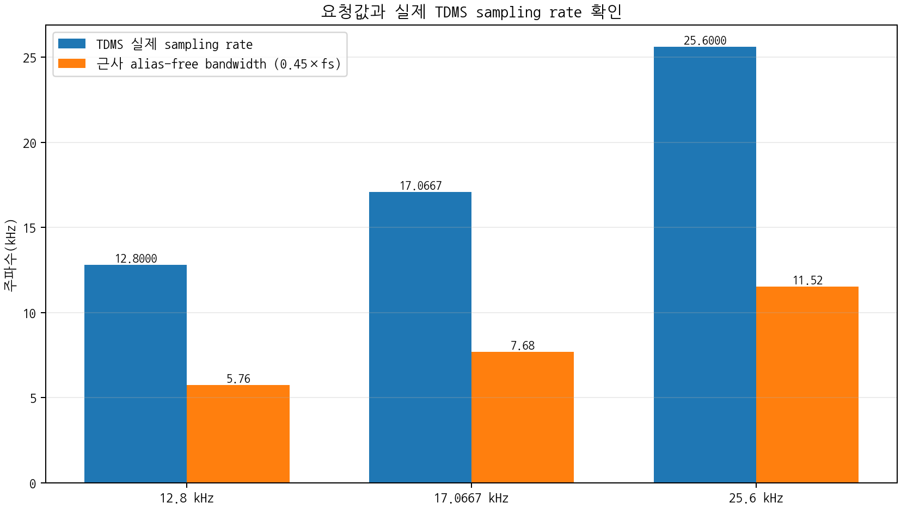
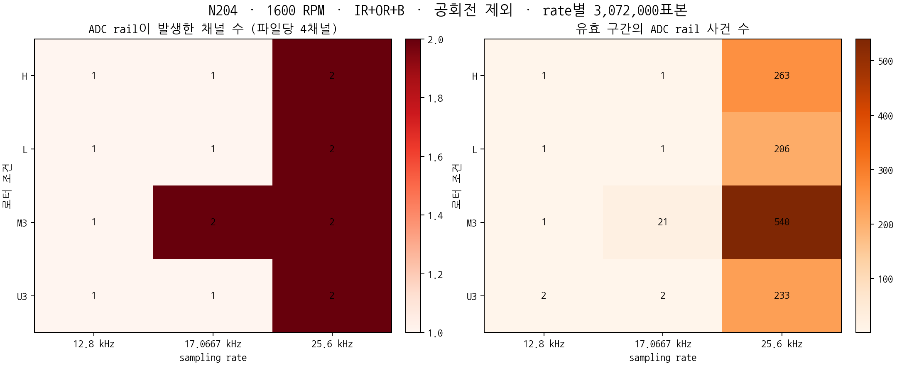
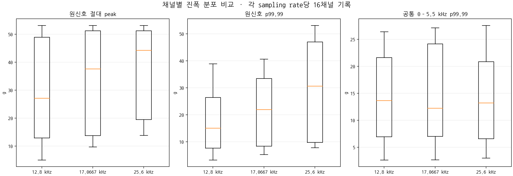

# Sampling rate가 clipping에 미치는 영향

- 분석일: 2026-08-04
- 조건: N204·1600 RPM·베어링 IR+OR+B
- 로터 조건: H·L·M3·U3
- 비교 rate: 12.8·17.0667·25.6 kHz

## 1. 결론

- 세 sampling rate 모두 요청값대로 수집됨
- sampling rate가 높을수록 저장된 ADC rail 횟수가 크게 증가함
- 12.8 kHz에서도 네 파일 모두 exact ADC rail이 발생하여 clipping이 제거되지는 않음
- 따라서 `25.6 kHz가 clipping을 새로 발생시킨 원인`이라는 해석은 부적절함
- 현재 근거에 맞는 해석은 `높은 sampling rate가 더 넓은 대역과 더 짧은 충격을 기록하여 clipping 표본을 더 많이 남김`임
- clipping을 줄이기 위해 12.8 kHz를 선택하면 고주파 정보를 함께 잃으므로 sampling rate를 clipping 회피 수단으로 사용하면 안 됨

## 2. 비교 설계

| 설정 rate | 공회전 제외 구간 | 사용 시간 | 채널당 표본 | NI-9234 분주값 n |
|---:|---:|---:|---:|---:|
| 12.8 kHz | 60~300초 | 240초 | 3,072,000 | 4 |
| 17.0667 kHz | 60~240초 | 180초 | 3,072,000 | 3 |
| 25.6 kHz | 60~180초 | 120초 | 3,072,000 | 2 |

- 표본 수는 같지만 실제 관측시간은 4·3·2분으로 다름
- rail 표본 수는 동일한 표본 수 기준으로 비교함
- rail 사건률은 실제 관측시간 차이를 보정해 채널·분당 값도 함께 비교함
- 세 rate는 동시에 수집한 동일 파형이 아니라 서로 다른 운전 run임

## 3. sampling rate 확인

| 설정값 | TDMS 실제값 | metadata | Nyquist | 근사 alias-free 대역 | 판정 |
|---:|---:|---:|---:|---:|---|
| 12.8 kHz | 12,800.0000 Hz | 12,800 Hz | 6.40 kHz | 5.76 kHz | 일치함 |
| 17.0667 kHz | 17,066.6667 Hz | 17,066.67 Hz | 8.53 kHz | 7.68 kHz | 반올림 범위에서 일치함 |
| 25.6 kHz | 25,600.0000 Hz | 25,600 Hz | 12.80 kHz | 11.52 kHz | 일치함 |

- `wf_increment`로 계산한 실제 rate 사용함
- 네 채널 모두 각 파일에서 동일한 rate와 표본 수를 가짐
- 진동 신호의 1× 후보 중앙값은 세 rate 모두 약 1,601 RPM임
- 전체 1× 후보 범위는 약 1,597.5~1,605.0 RPM임
- 타코미터 실측값이 아니라 진동 신호 기반 후보값임

## 4. clipping 비교

| rate | rail 파일 | rail 채널 | exact rail 표본 | exact rail 사건 | 채널·분당 사건 | 50 g 초과 표본 |
|---:|---:|---:|---:|---:|---:|---:|
| 12.8 kHz | 4/4 | 4/16 | 5 | 5 | 0.078 | 14 |
| 17.0667 kHz | 4/4 | 5/16 | 25 | 25 | 0.521 | 56 |
| 25.6 kHz | 4/4 | 8/16 | 1,252 | 1,242 | 38.813 | 1,916 |

### 조건별 exact rail 사건 수

| 로터 조건 | 12.8 kHz | 17.0667 kHz | 25.6 kHz |
|---|---:|---:|---:|
| H | 1 | 1 | 263 |
| L | 1 | 1 | 206 |
| M3 | 1 | 21 | 540 |
| U3 | 2 | 2 | 233 |

- 12.8 kHz에서도 모든 로터 조건의 CH0가 rail에 도달함
- 17.0667 kHz의 M3에서는 CH0·CH1에서 rail 발생함
- 25.6 kHz에서는 네 로터 조건 모두 CH0·CH1에서 rail 발생함
- 낮은 rate가 clipping 흔적을 크게 줄였지만 측정범위 부족을 해결하지는 못함 [SRCLIP-E02]

## 5. 진폭 분포와 공통 대역 비교

| rate | 원신호 RMS 중앙값 | 원신호 p99.99 중앙값 | 원신호 peak 중앙값 | 공통 0~5.5 kHz p99.99 중앙값 |
|---:|---:|---:|---:|---:|
| 12.8 kHz | 1.47 g | 15.06 g | 27.15 g | 13.65 g |
| 17.0667 kHz | 1.78 g | 21.97 g | 37.64 g | 12.24 g |
| 25.6 kHz | 2.16 g | 30.69 g | 44.24 g | 13.19 g |

- 원신호 RMS·p99.99·peak는 rate 증가와 함께 커짐
- 세 rate를 모두 0~5.5 kHz로 제한하면 p99.99 중앙값이 12.24~13.65 g로 비슷해짐
- rate 증가에 따른 원신호 꼬리 진폭 차이의 상당 부분이 5.5 kHz 위 추가 대역과 관련됨
- 공통 대역 필터는 clipping 이후 저장값에 적용한 결과이므로 clipping 이전 실제 진폭 복원값이 아님

## 6. 실행 판단

| 질문 | 현재 답변 |
|---|---|
| 설정한 Hz로 제대로 수집됐는가 | 예. TDMS 시간축과 metadata 모두 일치함 |
| sampling rate가 clipping 표본 수에 영향을 주는가 | 예. 현재 run에서는 rate가 높을수록 rail 표본·사건이 크게 증가함 |
| 25.6 kHz만 clipping을 발생시키는가 | 아니오. 12.8·17.0667 kHz에서도 모든 파일에 exact rail 존재함 |
| 12.8 kHz로 낮추면 장비 문제가 해결되는가 | 아니오. clipping을 덜 관측할 뿐 제거하지 못함 |
| 이 결과만으로 rate의 인과효과가 확정되는가 | 아니오. rate별 run이 서로 다르고 반복 수집이 없음 |

### 권장 사항

- sampling rate는 clipping 회피가 아니라 필요한 물리 대역을 기준으로 결정함
- 25.6 kHz 후보를 낮추기 전에 5.5 kHz 위 성분의 결함 검증 기여를 먼저 판단함
- 같은 조건에서 rate 순서를 무작위로 바꿔 각 rate 3회 이상 반복함
- rail이 모든 rate에서 재현되므로 마운팅·센서 개체·DAQ 채널 교차시험을 계속함
- 절대 peak 보존이 필요하면 저감도 기준 센서 A/B 시험 필요함

## 7. 한계

- rate별로 서로 다른 시각에 수집한 run임
- 표본 수는 같지만 관측시간이 달라 실제 충격 발생 기회가 같지 않음
- rate 순서와 장비 warm-up 영향이 통제되지 않음
- N204·1600 RPM·IR+OR+B 한 베어링 결함 조건만 분석함
- 현재 결과로 다른 베어링·RPM에 일반화할 수 없음

## 8. 근거 파일

| Evidence ID | 근거 |
|---|---|
| SRCLIP-E01 | `results/sampling_rate_channel_metrics.csv`의 실제 rate·표본 수·1× 후보임 |
| SRCLIP-E02 | `results/sampling_rate_file_metrics.csv`의 파일별 rail 표본·사건임 |
| SRCLIP-E03 | `results/sampling_rate_summary.csv`의 rate별 clipping·진폭 요약임 |
